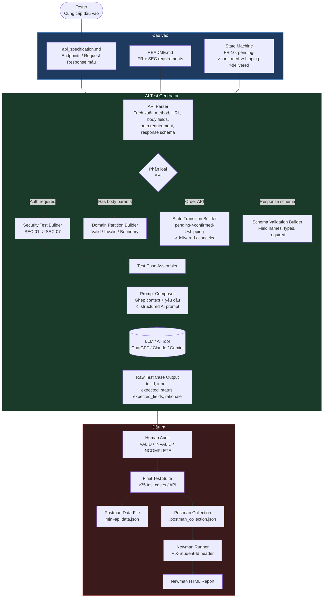
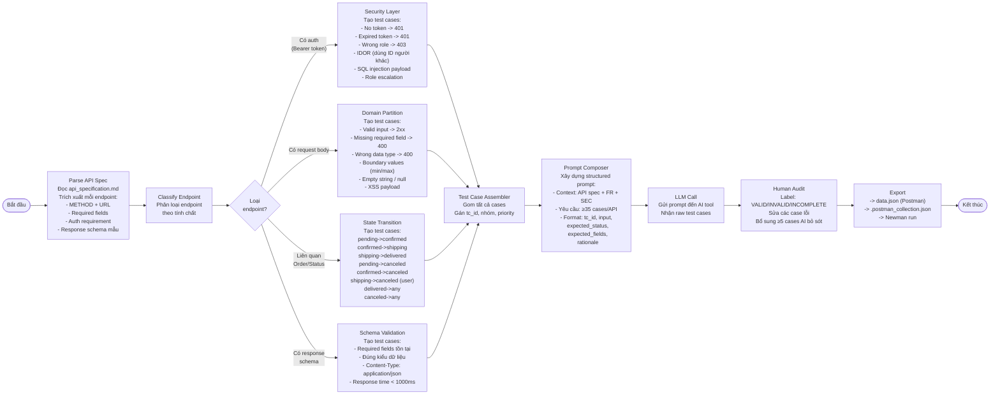

# AI-Driven API Test Generator — Design Document

> **Phạm vi:** Thiết kế một AI-driven test generator cho EShop SUT.
> Khi nhận đặc tả API (`api_specification.md`), generator tự động sản sinh test case bao phủ các nhóm:
> domain partitions, state transitions, security (SEC-01–SEC-07), và schema validation.
> Đây là **thiết kế blackbox** — generator chỉ đọc API spec, không đọc source code.

---

## 1. Sơ đồ tổng quan (Architecture Diagram)



---

## 2. Sơ đồ luồng chi tiết — Test Case Generation Pipeline



---

## 3. Pseudocode

```python
# ============================================================
# AI-Driven API Test Generator for EShop SUT
# Blackbox testing — chỉ đọc API spec, không đọc source code
# ============================================================

FUNCTION main():
    # Bước 1: Nạp tài liệu đầu vào
    api_spec    = load_file("api_specification.md")
    requirements = load_file("README.md")          # FR + SEC rules
    state_machine = parse_state_machine(requirements)
    # state_machine = {
    #   "pending":   ["confirmed", "canceled"],
    #   "confirmed": ["shipping",  "canceled"],
    #   "shipping":  ["delivered"],   # user KHÔNG được cancel ở đây
    #   "delivered": [],              # final state
    #   "canceled":  []               # final state
    # }

    # Bước 2: Parse API spec → danh sách endpoint objects
    endpoints = parse_api_spec(api_spec)
    # Mỗi endpoint = {
    #   method, url, auth_required, body_fields,
    #   response_schema, is_order_api
    # }

    all_test_cases = []

    # Bước 3: Với mỗi API đã chọn, sinh test cases
    FOR EACH selected_endpoint IN [pool_A_api, pool_B_api, pool_C_api]:
        tc_list = generate_test_cases(selected_endpoint, state_machine)
        all_test_cases.extend(tc_list)

    # Bước 4: Human audit
    audited = human_audit(all_test_cases)

    # Bước 5: Export ra Postman format
    export_to_postman(audited)

# ============================================================
FUNCTION generate_test_cases(endpoint, state_machine):
    tc_list = []
    base_id = endpoint.url.replace("/", "_").upper()

    # --- Nhóm A: Domain Partition ---
    IF endpoint.body_fields IS NOT EMPTY:
        tc_list += build_domain_partition_cases(endpoint, base_id)

    # --- Nhóm B: Security ---
    IF endpoint.auth_required:
        tc_list += build_security_cases(endpoint, base_id)

    # --- Nhóm C: State Transition ---
    IF endpoint.is_order_api:
        tc_list += build_state_transition_cases(endpoint, state_machine, base_id)

    # --- Nhóm D: Schema Validation ---
    tc_list += build_schema_validation_cases(endpoint, base_id)

    # --- Gửi cho LLM để hoàn chỉnh ---
    prompt = compose_prompt(endpoint, tc_list)
    ai_output = call_llm(prompt)
    tc_list   = merge(tc_list, ai_output)

    RETURN tc_list

# ============================================================
FUNCTION build_domain_partition_cases(endpoint, base_id):
    cases = []
    idx   = 1

    FOR EACH field IN endpoint.body_fields:
        # Partition: Valid
        cases.append({
            "tc_id":           f"{base_id}_DOM_{idx:02d}",
            "group":           "Domain Partition",
            "description":     f"Valid {field.name}: giá trị hợp lệ điển hình",
            "input":           { field.name: field.valid_example },
            "expected_status": endpoint.success_status,   # 200 hoặc 201
            "expected_fields": endpoint.response_schema.required_fields,
            "rationale":       "Happy path — giá trị hợp lệ phải được chấp nhận"
        })
        idx += 1

        # Partition: Missing required field
        IF field.required:
            body_without_field = endpoint.body_fields - {field}
            cases.append({
                "tc_id":           f"{base_id}_DOM_{idx:02d}",
                "group":           "Domain Partition - Negative",
                "description":     f"Thiếu field bắt buộc: {field.name}",
                "input":           body_without_field,
                "expected_status": 400,
                "expected_fields": ["message"],
                "rationale":       "Field bắt buộc bị thiếu phải trả 400"
            })
            idx += 1

        # Partition: Wrong type
        cases.append({
            "tc_id":           f"{base_id}_DOM_{idx:02d}",
            "group":           "Domain Partition - Negative",
            "description":     f"Sai kiểu dữ liệu cho {field.name}",
            "input":           { field.name: field.wrong_type_example },
            "expected_status": 400,
            "expected_fields": ["message"],
            "rationale":       "Sai type phải bị từ chối"
        })
        idx += 1

        # Partition: Boundary (nếu field có giới hạn)
        IF field.has_boundaries:
            cases.append({
                "tc_id":           f"{base_id}_DOM_{idx:02d}",
                "group":           "Domain Partition - Boundary",
                "description":     f"Biên dưới: {field.name} = {field.min_value}",
                "input":           { field.name: field.min_value },
                "expected_status": endpoint.success_status,
                "rationale":       "Giá trị biên dưới hợp lệ phải được chấp nhận"
            })
            idx += 1

            cases.append({
                "tc_id":           f"{base_id}_DOM_{idx:02d}",
                "group":           "Domain Partition - Boundary",
                "description":     f"Dưới biên dưới: {field.name} = {field.min_value - 1}",
                "input":           { field.name: field.min_value - 1 },
                "expected_status": 400,
                "rationale":       "Dưới giá trị tối thiểu phải bị từ chối"
            })
            idx += 1

    RETURN cases

# ============================================================
FUNCTION build_security_cases(endpoint, base_id):
    cases = []
    idx   = 1

    # SEC-02: Không có token
    cases.append({
        "tc_id":           f"{base_id}_SEC_{idx:02d}",
        "group":           "Security",
        "description":     "Không gửi Authorization header",
        "headers":         {},                           # bỏ token
        "expected_status": 401,
        "expected_fields": ["message"],
        "rationale":       "SEC-02 — API bảo mật phải từ chối request không có token"
    })
    idx += 1

    # SEC-02: Token hết hạn
    cases.append({
        "tc_id":           f"{base_id}_SEC_{idx:02d}",
        "group":           "Security",
        "description":     "Gửi token đã hết hạn",
        "headers":         {"Authorization": "Bearer {{expiredToken}}"},
        "expected_status": 401,
        "rationale":       "SEC-02 — Token hết hạn phải bị từ chối"
    })
    idx += 1

    # SEC-03: Sai role (user thường gọi endpoint admin)
    IF endpoint.requires_admin:
        cases.append({
            "tc_id":           f"{base_id}_SEC_{idx:02d}",
            "group":           "Security",
            "description":     "User role thường gọi endpoint yêu cầu admin",
            "headers":         {"Authorization": "Bearer {{userToken}}"},
            "expected_status": 403,
            "rationale":       "SEC-03 — Phân biệt 401 (chưa xác thực) vs 403 (không đủ quyền)"
        })
        idx += 1

    # SEC-05: SQL Injection
    cases.append({
        "tc_id":           f"{base_id}_SEC_{idx:02d}",
        "group":           "Security - Injection",
        "description":     "SQL Injection payload trong input field",
        "input":           {"email": "' OR '1'='1"; "--"},
        "expected_status": [400, 401],   # KHÔNG được là 500
        "rationale":       "SEC-05 — Parameterized query phải ngăn SQL injection; không crash server"
    })
    idx += 1

    # IDOR: Truy cập tài nguyên của user khác
    IF endpoint.has_resource_id:
        cases.append({
            "tc_id":           f"{base_id}_SEC_{idx:02d}",
            "group":           "Security - IDOR",
            "description":     "Truy cập resource của user khác bằng ID",
            "input":           {"id": "{{otherUserId}}"},
            "expected_status": [403, 404],
            "rationale":       "IDOR — User không được đọc/sửa dữ liệu của người khác"
        })
        idx += 1

    # SEC-06: Role escalation qua request body
    IF endpoint.url == "/api/users/me" AND endpoint.method == "PUT":
        cases.append({
            "tc_id":           f"{base_id}_SEC_{idx:02d}",
            "group":           "Security - Role Escalation",
            "description":     "Thử thay đổi field role qua body",
            "input":           {"name": "Test", "role": "admin"},
            "expected_status": 200,
            "postcondition":   "role trong DB KHÔNG được thay đổi",
            "rationale":       "SEC-06 — API cập nhật hồ sơ không được cho phép đổi role"
        })
        idx += 1

    RETURN cases

# ============================================================
FUNCTION build_state_transition_cases(endpoint, state_machine, base_id):
    cases = []
    idx   = 1

    # Duyệt mọi cặp (from_state → to_state) từ state machine
    ALL_STATES = ["pending", "confirmed", "shipping", "delivered", "canceled"]

    FOR EACH from_state IN ALL_STATES:
        valid_targets = state_machine[from_state]   # trạng thái hợp lệ kế tiếp

        # Valid transitions
        FOR EACH to_state IN valid_targets:
            cases.append({
                "tc_id":           f"{base_id}_STM_{idx:02d}",
                "group":           "State Transition - Valid",
                "precondition":    f"Đơn hàng đang ở trạng thái: {from_state}",
                "input":           {"status": to_state},
                "expected_status": 200,
                "postcondition":   f"Trạng thái đơn hàng = {to_state}",
                "rationale":       f"Luồng hợp lệ: {from_state} → {to_state} (FR-10)"
            })
            idx += 1

        # Invalid transitions (tất cả trạng thái còn lại)
        invalid_targets = ALL_STATES - valid_targets - {from_state}
        FOR EACH to_state IN invalid_targets:
            cases.append({
                "tc_id":           f"{base_id}_STM_{idx:02d}",
                "group":           "State Transition - Invalid",
                "precondition":    f"Đơn hàng đang ở trạng thái: {from_state}",
                "input":           {"status": to_state},
                "expected_status": 400,
                "rationale":       f"Chuyển trạng thái không hợp lệ: {from_state} → {to_state}"
            })
            idx += 1

    # Đặc biệt: user tự hủy khi đang shipping (FR-10)
    cases.append({
        "tc_id":           f"{base_id}_STM_{idx:02d}",
        "group":           "State Transition - User Cancel Restriction",
        "precondition":    "Đơn hàng đang ở trạng thái shipping, gọi bởi user thường",
        "endpoint":        "PUT /api/orders/:id/cancel",
        "headers":         {"Authorization": "Bearer {{userToken}}"},
        "expected_status": 403,
        "rationale":       "FR-10 — User không được hủy đơn khi đang shipping; chỉ Admin mới được"
    })
    idx += 1

    # Final state: không được chuyển tiếp
    FOR EACH final_state IN ["delivered", "canceled"]:
        FOR EACH any_status IN ALL_STATES:
            IF any_status != final_state:
                cases.append({
                    "tc_id":           f"{base_id}_STM_{idx:02d}",
                    "group":           "State Transition - Final State",
                    "precondition":    f"Đơn hàng đang ở trạng thái kết thúc: {final_state}",
                    "input":           {"status": any_status},
                    "expected_status": 400,
                    "rationale":       f"FR-10 — {final_state} là trạng thái kết thúc, không chuyển tiếp được"
                })
                idx += 1

    RETURN cases

# ============================================================
FUNCTION build_schema_validation_cases(endpoint, base_id):
    cases = []
    idx   = 1

    # Kiểm tra Content-Type header
    cases.append({
        "tc_id":       f"{base_id}_SCH_{idx:02d}",
        "group":       "Schema Validation",
        "description": "Response phải có Content-Type: application/json",
        "assertion":   "pm.expect(pm.response.headers.get('Content-Type')).to.include('application/json')",
        "rationale":   "API phải trả JSON, không phải text/html"
    })
    idx += 1

    # Kiểm tra response time
    cases.append({
        "tc_id":       f"{base_id}_SCH_{idx:02d}",
        "group":       "Schema Validation",
        "description": "Response time phải < 1000ms",
        "assertion":   "pm.expect(pm.response.responseTime).to.be.below(1000)",
        "rationale":   "Performance SLA cơ bản"
    })
    idx += 1

    # Kiểm tra từng required field trong response schema
    FOR EACH field IN endpoint.response_schema.required_fields:
        cases.append({
            "tc_id":       f"{base_id}_SCH_{idx:02d}",
            "group":       "Schema Validation",
            "description": f"Response phải chứa field: {field.name} với kiểu {field.type}",
            "assertion":   f"pm.expect(jsonData).to.have.property('{field.name}')",
            "rationale":   f"Đặc tả yêu cầu field {field.name} phải có trong response"
        })
        idx += 1

    RETURN cases

# ============================================================
FUNCTION compose_prompt(endpoint, initial_cases):
    """
    Xây dựng structured prompt gửi cho AI tool.
    Không dùng prompt chung chung — hướng dẫn AI từng bước.
    """
    prompt = f"""
Bối cảnh: Tôi đang kiểm thử blackbox API EShop tại endpoint:
  {endpoint.method} {endpoint.url}

Đặc tả:
- Request body: {endpoint.body_fields}
- Response thành công: {endpoint.response_schema}
- Auth yêu cầu: {endpoint.auth_required}
- Liên quan state machine: {endpoint.is_order_api}

Yêu cầu bảo mật từ spec: SEC-01 đến SEC-07.

Tôi đã có {len(initial_cases)} test cases sau (danh sách):
{format_cases(initial_cases)}

Nhiệm vụ của bạn:
1. Đánh giá các test case trên: xác nhận đủ bao phủ chưa.
2. Đề xuất thêm test case để đạt tổng >= 35 cases, tập trung vào:
   - Domain partitions còn thiếu (giá trị biên, null, ký tự đặc biệt)
   - Security cases còn thiếu (token format lạ, concurrent requests)
   - State transitions edge cases
   - Schema validation (field types, nested objects)
3. Trả kết quả dạng bảng với các cột:
   tc_id | group | description | input | expected_status | expected_fields | rationale

KHÔNG tự bịa field không có trong spec. Nếu thiếu thông tin, hãy hỏi lại.
"""
    RETURN prompt

# ============================================================
FUNCTION human_audit(tc_list):
    """
    Tester duyệt từng test case, gán nhãn và sửa lỗi.
    """
    audited = []
    FOR EACH tc IN tc_list:
        label = tester_review(tc)   # "VALID" / "INVALID" / "INCOMPLETE"

        IF label == "INVALID":
            tc = tester_correct(tc)
            label = "CORRECTED"

        IF label == "INCOMPLETE":
            tc = tester_complete(tc)
            label = "COMPLETED"

        tc["audit_label"] = label
        audited.append(tc)

    # Tester tự thêm ít nhất 5 cases AI bỏ sót
    extended = tester_extend(audited, min_count=5)
    RETURN extended

# ============================================================
FUNCTION export_to_postman(tc_list):
    """
    Xuất test cases ra định dạng Postman để chạy Newman.
    """
    data_file  = build_data_json(tc_list)       # mini-api.data.json
    collection = build_collection_json(tc_list)  # .postman_collection.json
    # Collection tự động thêm pre-request script:
    # pm.request.headers.upsert({
    #   key: "X-Student-Id",
    #   value: pm.environment.get("studentId")
    # });

    write_file("mini-api.data.json",               data_file)
    write_file("api.postman_collection.json",       collection)
    write_file("local.postman_environment.json",    build_env())

    # Lệnh chạy Newman
    PRINT """
newman run api.postman_collection.json \\
  --environment local.postman_environment.json \\
  --iteration-data mini-api.data.json \\
  --reporters cli,htmlextra \\
  --reporter-htmlextra-export newman-report.html
"""
```

---

## 4. Bảng phân tích Coverage

| Nhóm test | Nguồn logic | Từ spec | Ví dụ endpoint áp dụng |
|---|---|---|---|
| Domain Partition — Valid | `build_domain_partition_cases` | FR-01, FR-15, FR-17 | `POST /api/register`, `POST /api/products` |
| Domain Partition — Negative | `build_domain_partition_cases` | FR-01, FR-08 | `POST /api/register` (thiếu field), `POST /api/checkout` |
| Domain Partition — Boundary | `build_domain_partition_cases` | FR-04, FR-15 | `PUT /api/users/me` (phone length), `POST /api/products` (price > 0) |
| Security — No/Invalid Token | `build_security_cases` | SEC-02 | Tất cả API có `auth_required = true` |
| Security — Wrong Role (403) | `build_security_cases` | SEC-03 | `GET /api/admin/orders`, `DELETE /api/admin/users/:id` |
| Security — SQL Injection | `build_security_cases` | SEC-05 | `POST /api/login`, `GET /api/products?search=` |
| Security — IDOR | `build_security_cases` | SEC-02, FR-11 | `GET /api/orders/:id` |
| Security — Role Escalation | `build_security_cases` | SEC-06 | `PUT /api/users/me` |
| State Transition — Valid | `build_state_transition_cases` | FR-10 | `PUT /api/admin/orders/:id/status` |
| State Transition — Invalid | `build_state_transition_cases` | FR-10 | `PUT /api/admin/orders/:id/status` |
| State Transition — Final State | `build_state_transition_cases` | FR-10 | `PUT /api/admin/orders/:id/status` (delivered/canceled) |
| State Transition — User Cancel | `build_state_transition_cases` | FR-10 | `PUT /api/orders/:id/cancel` |
| Schema — Content-Type | `build_schema_validation_cases` | API spec | Tất cả endpoint |
| Schema — Response Time | `build_schema_validation_cases` | — | Tất cả endpoint |
| Schema — Required Fields | `build_schema_validation_cases` | API spec | Tất cả endpoint |