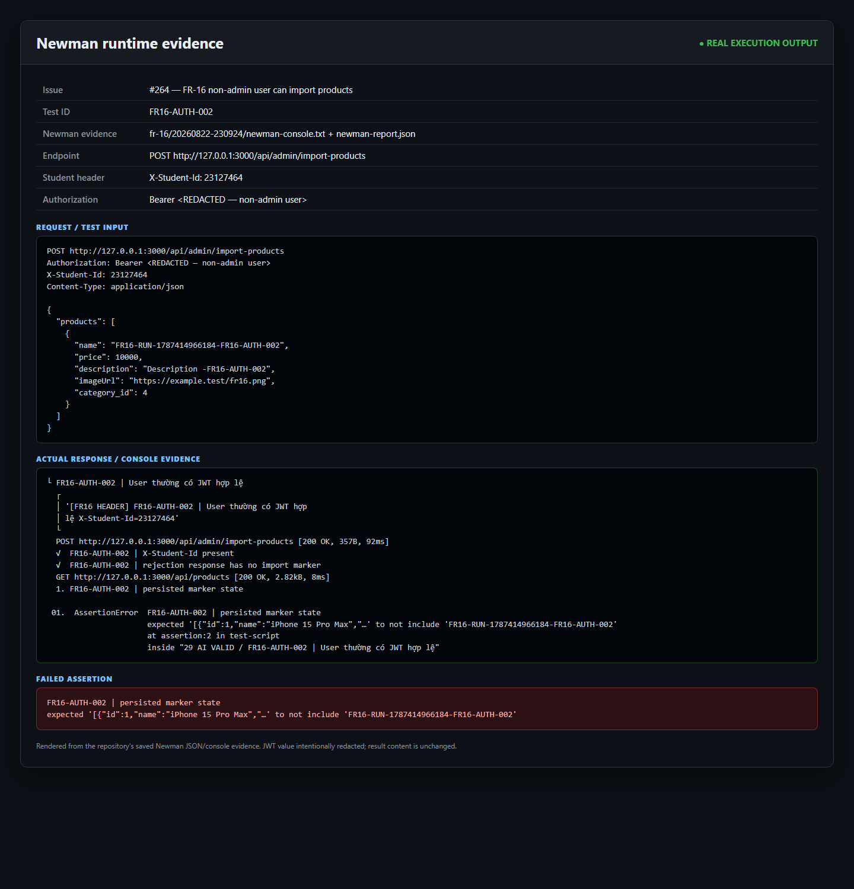

## Found by Test Case

FR16-AUTH-002, FR16-H05

## Requirement liên quan

FR-16, FR-12, SEC-03

## Severity / Priority

Critical / P0

## Environment

- OS: Windows 11
- Node.js: v22.18.0
- SUT: http://localhost:3000
- Newman: 6.2.2
- Student ID: 23127464

## Steps to reproduce

1. Gửi batch hợp lệ bằng JWT của user thường:

```bash
curl -i \
  -X POST \
  -H "Authorization: Bearer <NON_ADMIN_VALID_TOKEN>" \
  -H "X-Student-Id: 23127464" \
  -H "Content-Type: application/json" \
  --data '{"products":[{"name":"FR16-NONADMIN-REPRO","price":100,"description":"non-admin import","imageUrl":"https://example.test/fr16.png","category_id":<CATEGORY_ID>}]}' \
  "http://localhost:3000/api/admin/import-products"
```

2. Đọc lại danh sách product hoặc truy vấn DB bằng cơ chế quan sát được phê duyệt.
3. Tìm marker `FR16-NONADMIN-REPRO` và so sánh trạng thái trước/sau request.

## Expected result

- Request của non-admin phải bị từ chối theo FR-12 và SEC-03.
- Không product nào trong batch được tạo.
- Không tự đặt exact rejection status code hoặc error schema vì contract không công bố các chi tiết này.

## Actual result

- Server trả `200 OK`.
- Product có marker của non-admin được lưu vào DB.
- Canonical run quan sát cùng hành vi với batch một product và batch ba product.

## Evidence

### Runtime screenshot

Ảnh dưới đây tổng hợp trực tiếp payload canonical, dòng console Newman thực tế và assertion persistence thất bại của `FR16-AUTH-002`. JWT non-admin đã được che.



[Mở ảnh PNG kích thước đầy đủ](runtime_screenshot/issue-264-fr16-auth-002-runtime-evidence.png)

- Final run: `tests/api-testing/evidence/fr-16/20260822-230924/`
- Newman console: `tests/api-testing/evidence/fr-16/20260822-230924/newman-console.txt`
- Newman JSON: `tests/api-testing/evidence/fr-16/20260822-230924/newman-report.json`
- Newman HTML: `tests/api-testing/evidence/fr-16/20260822-230924/newman-report.html`
- Execution analysis: `reports/api-testing/fr-16-phase-d-execution-analysis.md`
- Kết quả final: 113 assertions, 16 failed assertions, Newman exit code `1`.

Các assertion liên quan:

| Test case | Bằng chứng |
|---|---|
| `FR16-AUTH-002` | Non-admin gửi một product hợp lệ; marker vẫn xuất hiện trong danh sách sau request. |
| `FR16-H05` | Non-admin gửi batch ba product hợp lệ; marker `FR16-H05-A` vẫn tồn tại sau request. |

## Root cause

Tại `src/eshop-sut/backend/server.js:199`, route chỉ gắn middleware xác thực:

```js
app.post("/api/admin/import-products", authenticateToken, (req, res) => {
```

Middleware tại `src/eshop-sut/backend/server.js:100-110` chỉ lấy token, verify signature/expiry, gán payload vào `req.user` rồi gọi `next()`:

```js
jwt.verify(token, SECRET_KEY, (err, user) => {
  if (err) return res.status(403).json({ error: "Forbidden" });
  req.user = user;
  next();
});
```

Không có điều kiện kiểm tra `req.user.role === 'admin'` trước khi thực hiện import. Quan sát source phù hợp với unauthorized persistence được tái hiện trong canonical run.

## Impact

Bất kỳ tài khoản user thường nào có JWT hợp lệ đều có thể vượt qua ranh giới quyền admin để tạo sản phẩm hàng loạt. Lỗi có thể gây chèn dữ liệu trái phép, làm sai lệch catalog, tăng nhanh số bản ghi và ảnh hưởng tính toàn vẹn dữ liệu kinh doanh.
