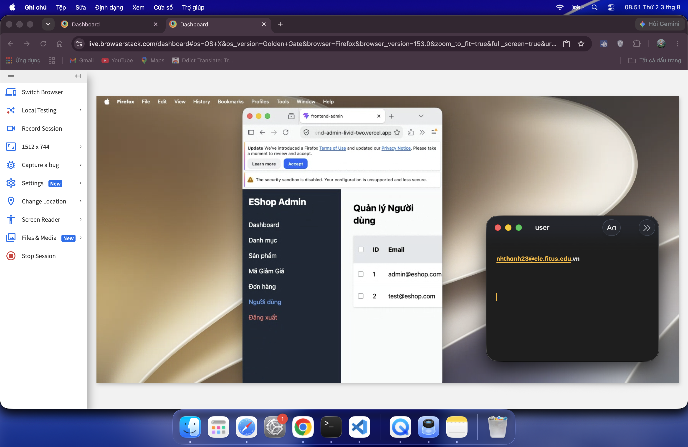
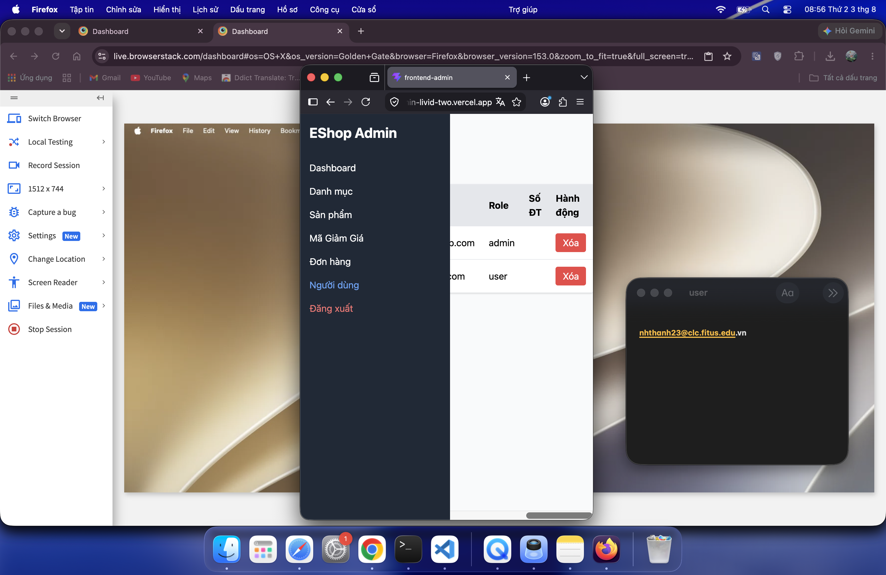
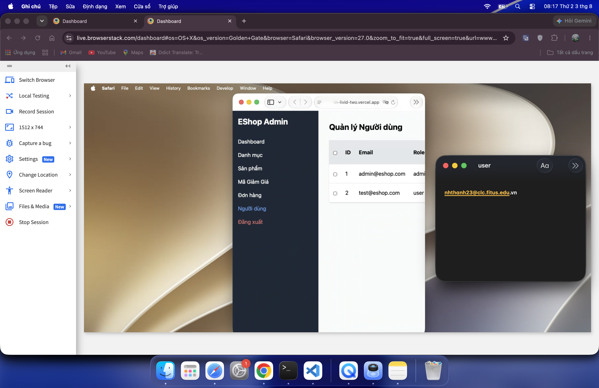
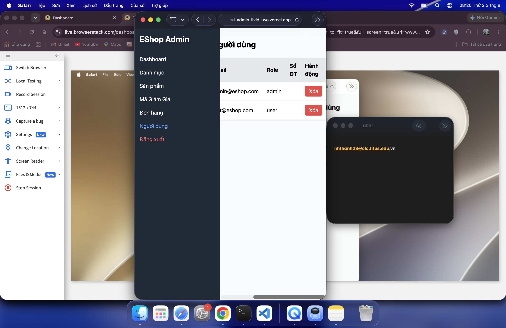

## Found by Test Case
CP-012 / GUI-058

## Requirement liên quan
GUI_Testing responsive + SRS GUI-01

## Severity / Priority
Major / P2

## Environment
- Chrome local baseline: Pass, lấy từ Task 1 `reports/gui-checklist.md`.
- Firefox 153 latest on BrowserStack Mac: Fail.
- Safari 27 latest on BrowserStack Mac: Fail.
- Web Admin URL: `http://localhost:5174/`.
- Backend URL: `http://localhost:3000`.

## Steps to reproduce
1. Mở Web Admin bằng Firefox 153 latest hoặc Safari 27 latest trên BrowserStack Mac.
2. Đăng nhập bằng tài khoản admin hợp lệ.
3. Đi tới User Management / Người dùng.
4. Chuyển browser/viewport sang kích thước hẹp tương tự checklist cross-platform.
5. Quan sát bảng danh sách người dùng và khả năng cuộn ngang/đọc các cột quan trọng.

## Expected result
Bảng User Management ở viewport hẹp vẫn có overflow hoặc cơ chế cuộn ngang rõ ràng. Các cột quan trọng không bị mất, không bị cắt chữ và admin vẫn đọc/thao tác được với bảng.

## Actual result
Trên Firefox và Safari BrowserStack, bảng User Management ở viewport hẹp không cuộn ngang được như Chrome local baseline. Nội dung bị mất/cắt chữ, làm các cột quan trọng khó đọc hoặc khó thao tác.

## Evidence
- Firefox screenshot 1: 
- Firefox screenshot 2: 
- Safari screenshot 1: 
- Safari screenshot 2: 
- Cross-platform checklist row: `CP-012`
- Source GUI checklist row: `GUI-058`

## GitHub issue
https://github.com/lmchkhi/CS423-CSC15003-Testing-N08/issues/203

## GitHub labels
- Type: Bug
- Status: New
- Module: User Management
- Priority: P2
- Severity: Major
