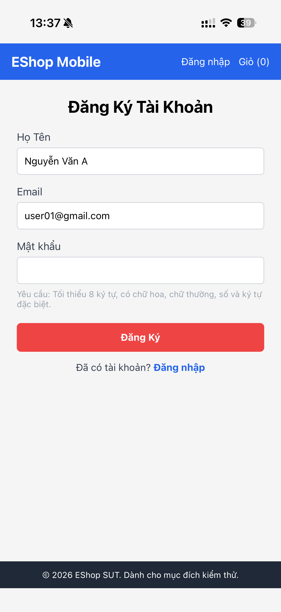
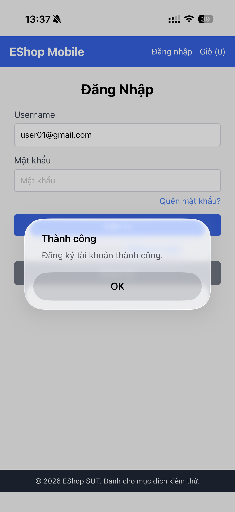

# BUG-FR-24-001: Màn hình đăng ký mobile không hiển thị trường Xác nhận mật khẩu nhưng vẫn cho phép đăng ký thành công

## Found by Test Case
TC-FR-24-001

## Requirement liên quan
FR-24: Đăng ký tài khoản (Mobile)

## Related Github issue
Issue #33

## Severity / Priority
High / P2

## Environment
- **Browser**: Expo Go
- **OS**: iOS
- **URL**: [Điền URL tại đây]

## Steps to reproduce
1. Mở màn hình Đăng ký.
2. Nhập `Họ Tên`: `Nguyễn Văn A`.
3. Nhập `Email`: `user01@gmail.com`.
4. Nhập `Mật khẩu`: `Abcd@1234`.
5. Quan sát màn hình: không có trường `Xác nhận mật khẩu`.
6. Bấm nút Đăng ký.

## Expected result
Đăng ký thành công, hệ thống chuyển tới màn hình Đăng nhập.

## Actual result
Màn hình đăng ký không có trường `Xác nhận mật khẩu` theo yêu cầu FR-24, nhưng hệ thống vẫn cho phép đăng ký thành công.

## Evidence
*Note*: Hình đầu đã nhập mật khẩu nhưng khi chụp ảnh màn hình thì mật khẩu không hiện (chỉ không hiện trong ảnh).

