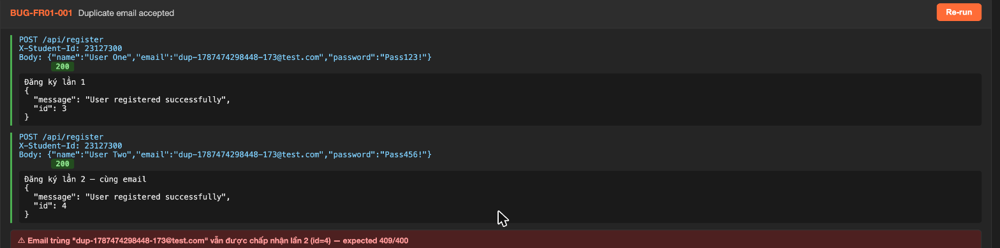

# [BUG][FR-01 Register] Duplicate email accepted without uniqueness constraint

## Found by Test Case
FR-01 Register API test case — vòng lặp dữ liệu phát hiện thiếu kiểm tra email duy nhất

## Requirement liên quan
FR-01 Register: Email phải là duy nhất trong hệ thống; không được tạo hai tài khoản có cùng email.

## Severity / Priority
Major / P1

## Environment
**Tool**: Postman collection v2.1 / Newman headless
**Collection**: `api/collections/eshop-hw06.postman_collection.json`
**Environment file**: `api/environments/local.postman_environment.json` (`baseUrl = http://localhost:3000`)
**Observed request host**: `http://127.0.0.1:3000` trong collection/Newman logs
**Folder / data / report**: `FR-01 Register`, `api/data/register-cases.json`, `api/newman/fr01-register-report.html`
**Anti-cheat header**: `X-Student-Id: 23127300`
**OS / Hardware / build**: Không được ghi nhận trong Newman artifact nộp; không dùng làm bằng chứng cho bug này.

## Steps to reproduce
1. Gửi `POST /api/register` với `{"name":"User1","email":"test@example.com","password":"Pass123!"}`.
2. Nhận `200 OK` với `id = 1`.
3. Gửi `POST /api/register` lần 2 với cùng email nhưng tên người dùng khác: `{"name":"User2","email":"test@example.com","password":"Pass456!"}`.
4. Quan sát hệ thống vẫn trả `200 OK` với `id = 2`.

## Expected result
Lần đăng ký thứ 2 phải bị từ chối với `409 Conflict` hoặc `400 Bad Request`, kèm thông báo như `"Email already exists"`.

## Actual result
Hệ thống chấp nhận cả hai lần đăng ký với cùng email. Phản hồi lần thứ 2 là `{"message":"User registered successfully","id":102}` với HTTP `200 OK`.

## Evidence
```bash
curl -X POST http://127.0.0.1:3000/api/register \
  -H "Content-Type: application/json" \
  -H "X-Student-Id: 23127300" \
  -d '{"name":"Test User","email":"duplicate@test.com","password":"Pass123!"}'

Phản hồi 1: {"message":"User registered successfully","id":101}

curl -X POST http://127.0.0.1:3000/api/register \
  -H "Content-Type: application/json" \
  -H "X-Student-Id: 23127300" \
  -d '{"name":"Different User","email":"duplicate@test.com","password":"Pass123!"}'

Phản hồi 2: {"message":"User registered successfully","id":102}
```

Dữ liệu từ Newman: vòng lặp 41 (`EX-001 duplicate email second register`) mong đợi `409`, nhưng SUT trả `200`.



## GitHub Issue
https://github.com/lmchkhi/CS423-CSC15003-Testing-N08/issues/252

Screenshot: [issue-252-bug-fr01-001.png](github-issues/issue-252-bug-fr01-001.png)
