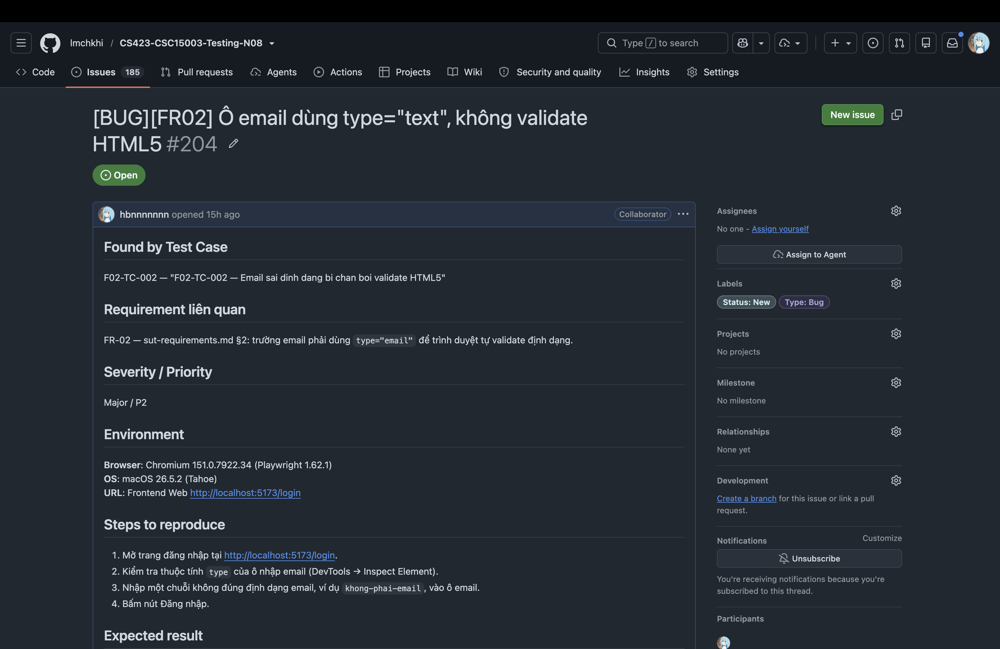
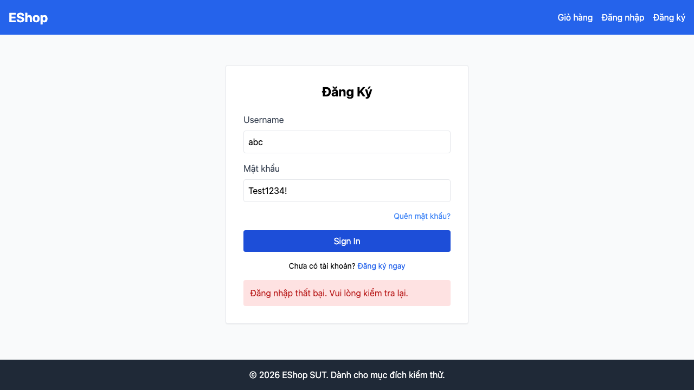

# BUG-FR02-001: Ô nhập email dùng `type="text"`, không chặn định dạng sai bằng validate HTML5

## Found by Test Case
F02-TC-002 — "F02-TC-002 — Email sai dinh dang bi chan boi validate HTML5"

## Requirement liên quan
FR-02 — `sut-requirements.md` §2: trường email phải dùng `type="email"` để trình duyệt tự validate định dạng.

## GitHub Issue
https://github.com/lmchkhi/CS423-CSC15003-Testing-N08/issues/204

## Severity / Priority
Major / P2

## Environment
**Browser**: Chromium 151.0.7922.34 (Playwright 1.62.1)
**OS**: macOS 26.5.2 (Tahoe)
**URL**: Frontend Web `http://localhost:5173/login`
**Ngày thực thi**: 08/08/2026

## Steps to reproduce
1. Mở trang đăng nhập tại `http://localhost:5173/login`.
2. Kiểm tra thuộc tính `type` của ô nhập email (DevTools → Inspect Element).
3. Nhập một chuỗi không đúng định dạng email, ví dụ `khong-phai-email`, vào ô email.
4. Bấm nút Đăng nhập.

## Expected result
Ô email có thuộc tính `type="email"`. Với chuỗi sai định dạng, trình duyệt tự chặn submit bằng cơ chế validate HTML5 gốc, không gửi request đăng nhập.

## Actual result
Ô email có thuộc tính `type="text"`. Trình duyệt không chặn gì cả — form submit bình thường với chuỗi sai định dạng, không có bước validate nào diễn ra trước khi gửi request.

## Evidence

## Duplicate check
Không tìm thấy bug report `BUG-FR02-*` nào khác trong `bug-reports/` của HW04 trước khi tạo report này. Cùng dạng lỗi với `BUG-FR02-002` của HW02 (`~/Downloads/23127300_HW02_AI_DomainTesting_100/bug-reports/`), số hiệu không trùng vì đây là bộ đếm bug report riêng của HW04.
