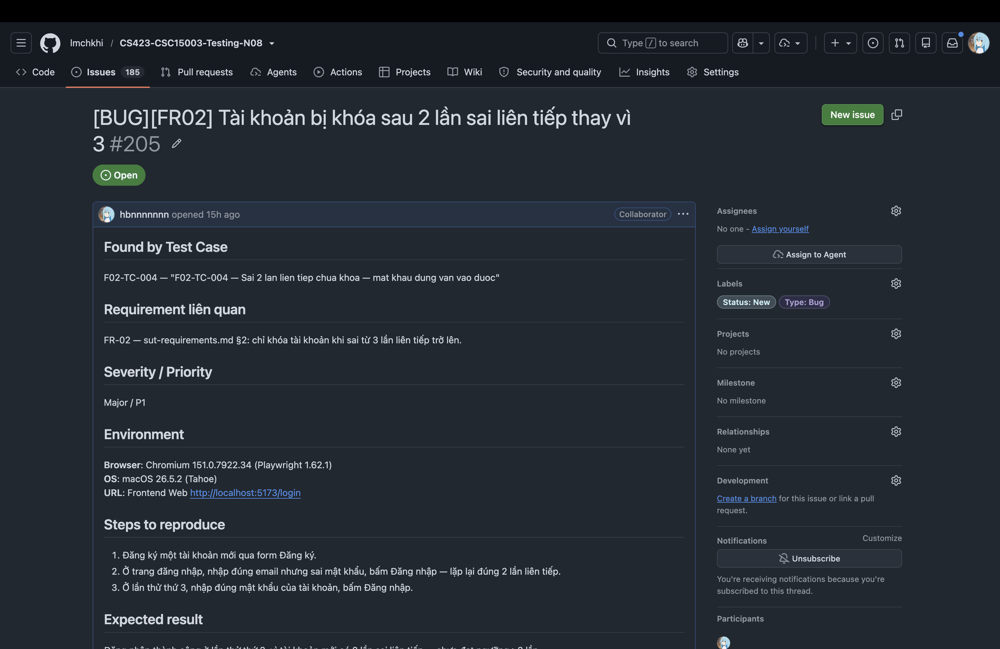
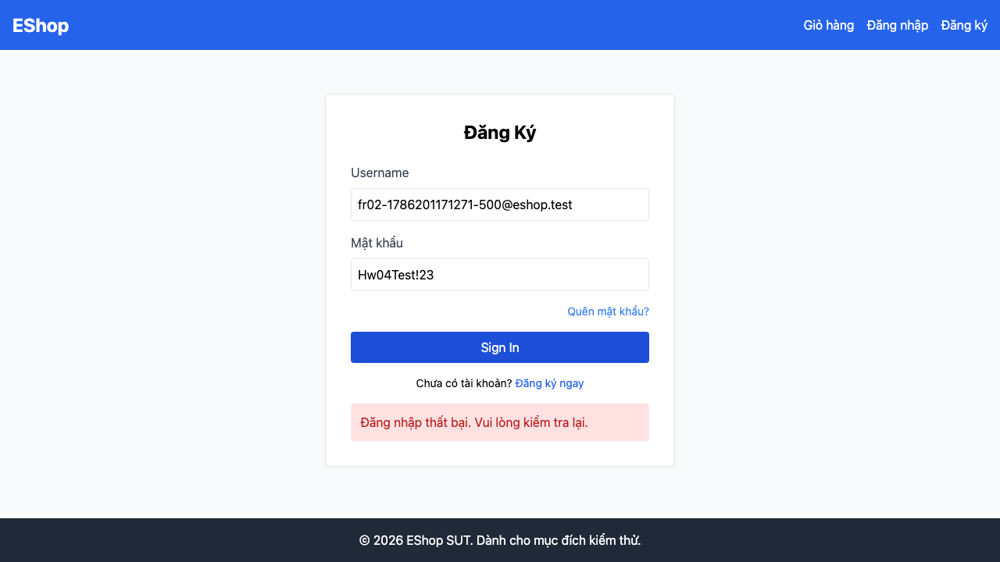

# BUG-FR02-002: Tài khoản bị khóa sau 2 lần sai liên tiếp thay vì 3

## Found by Test Case
F02-TC-004 — "F02-TC-004 — Sai 2 lan lien tiep chua khoa — mat khau dung van vao duoc"

## Requirement liên quan
FR-02 — `sut-requirements.md` §2: chỉ khóa tài khoản khi sai **từ 3 lần liên tiếp trở lên**.

## GitHub Issue
https://github.com/lmchkhi/CS423-CSC15003-Testing-N08/issues/205

## Severity / Priority
Major / P1

## Environment
**Browser**: Chromium 151.0.7922.34 (Playwright 1.62.1)
**OS**: macOS 26.5.2 (Tahoe)
**URL**: Frontend Web `http://localhost:5173/login`
**Ngày thực thi**: 08/08/2026

## Steps to reproduce
1. Đăng ký một tài khoản mới qua form Đăng ký.
2. Ở trang đăng nhập, nhập đúng email nhưng sai mật khẩu, bấm Đăng nhập — lặp lại đúng **2 lần liên tiếp**.
3. Ở lần thử thứ 3, nhập đúng mật khẩu của tài khoản, bấm Đăng nhập.

## Expected result
Đăng nhập thành công ở lần thử thứ 3, vì tài khoản mới có 2 lần sai liên tiếp — chưa đạt ngưỡng ≥3 lần mà đặc tả yêu cầu để khóa.

## Actual result
Hệ thống từ chối đăng nhập ngay cả khi mật khẩu ở lần thứ 3 là đúng — tài khoản đã bị khóa từ trước đó, tức là khóa kích hoạt sớm hơn một đơn vị so với đặc tả.

## Evidence

## Duplicate check
Không tìm thấy bug report `BUG-FR02-*` nào khác trong `bug-reports/` của HW04 trước khi tạo report này. Cùng dạng lỗi với `BUG-FR02-003` của HW02.
