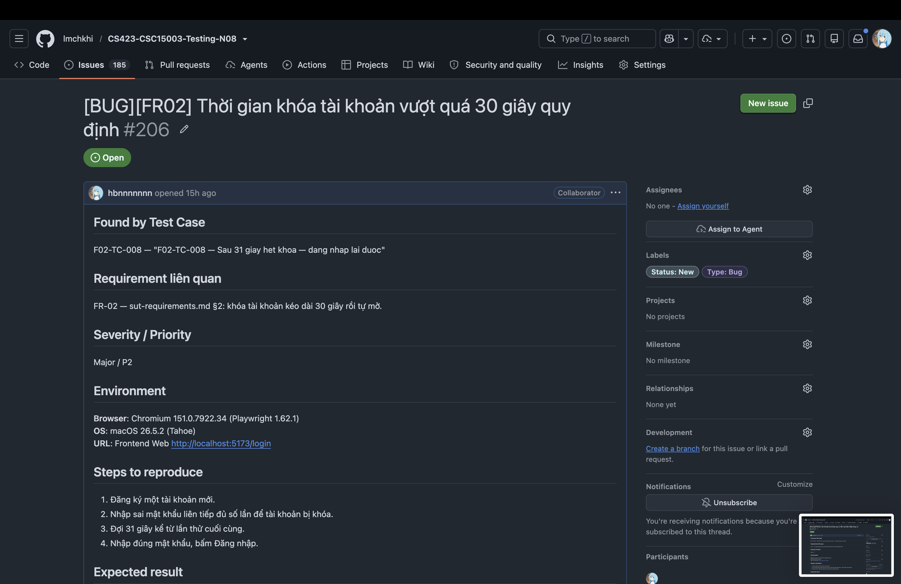
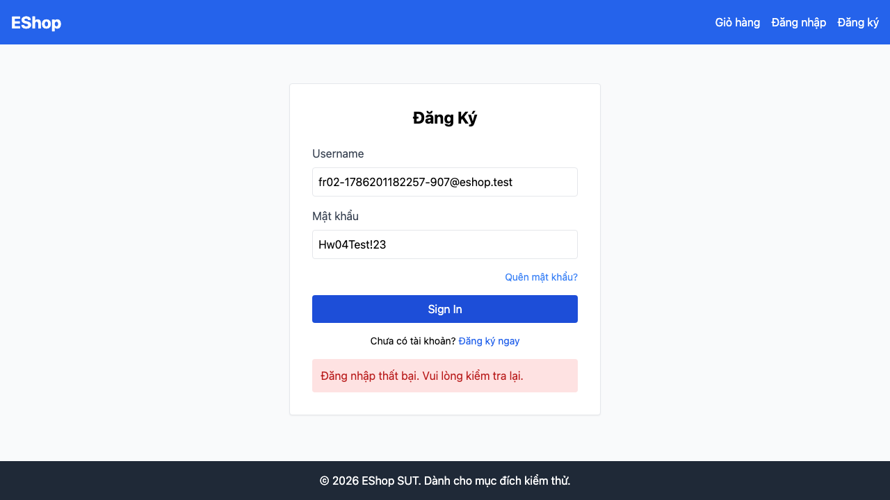

# BUG-FR02-003: Thời gian khóa tài khoản vượt quá 30 giây quy định

## Found by Test Case
F02-TC-008 — "F02-TC-008 — Sau 31 giay het khoa — dang nhap lai duoc"

## Requirement liên quan
FR-02 — `sut-requirements.md` §2: khóa tài khoản kéo dài **30 giây** rồi tự mở.

## GitHub Issue
https://github.com/lmchkhi/CS423-CSC15003-Testing-N08/issues/206

## Severity / Priority
Major / P2

## Environment
**Browser**: Chromium 151.0.7922.34 (Playwright 1.62.1)
**OS**: macOS 26.5.2 (Tahoe)
**URL**: Frontend Web `http://localhost:5173/login`
**Ngày thực thi**: 08/08/2026

## Steps to reproduce
1. Đăng ký một tài khoản mới.
2. Nhập sai mật khẩu liên tiếp đủ số lần để tài khoản bị khóa.
3. Đợi 31 giây kể từ lần thử cuối cùng.
4. Nhập đúng mật khẩu, bấm Đăng nhập.

## Expected result
Đăng nhập thành công, vì đã qua mốc 30 giây khóa theo đặc tả.

## Actual result
Hệ thống vẫn từ chối đăng nhập sau 31 giây — tài khoản còn trong trạng thái khóa. HW02 từng đo thời gian khóa thực tế kéo dài khoảng 180 giây.

## Evidence

## Duplicate check
Không tìm thấy bug report `BUG-FR02-*` nào khác trong `bug-reports/` của HW04 trước khi tạo report này. Cùng dạng lỗi với `BUG-FR02-005` của HW02.
