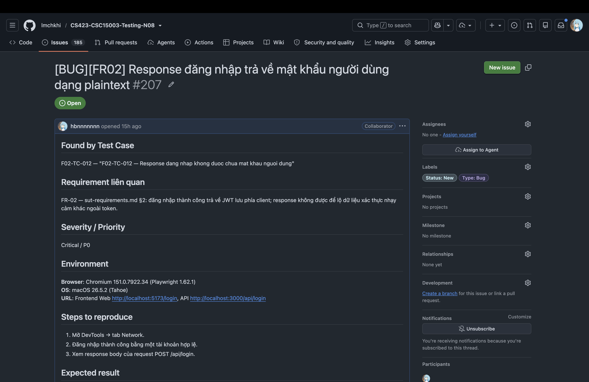
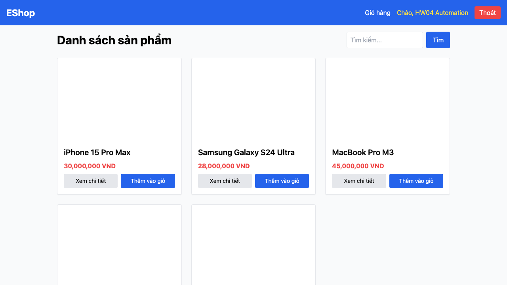

# BUG-FR02-004: Response đăng nhập trả về mật khẩu người dùng ở dạng plaintext

## Found by Test Case
F02-TC-012 — "F02-TC-012 — Response dang nhap khong duoc chua mat khau nguoi dung"

## Requirement liên quan
FR-02 — `sut-requirements.md` §2: đăng nhập thành công trả về JWT lưu phía client; response không được để lộ dữ liệu xác thực nhạy cảm khác ngoài token.

## GitHub Issue
https://github.com/lmchkhi/CS423-CSC15003-Testing-N08/issues/207

## Severity / Priority
Critical / P0

## Environment
**Browser**: Chromium 151.0.7922.34 (Playwright 1.62.1)
**OS**: macOS 26.5.2 (Tahoe)
**URL**: Frontend Web `http://localhost:5173/login`, API `http://localhost:3000/api/login`
**Ngày thực thi**: 08/08/2026

## Steps to reproduce
1. Mở DevTools → tab Network.
2. Đăng nhập thành công bằng một tài khoản hợp lệ.
3. Xem response body của request `POST /api/login`.

## Expected result
Response chỉ chứa token và thông tin người dùng không nhạy cảm; không có trường mật khẩu.

## Actual result
Response body chứa trường `password` ở dạng plaintext, y hệt mật khẩu vừa nhập.

## Evidence

## Duplicate check
Không tìm thấy bug report `BUG-FR02-*` nào khác trong `bug-reports/` của HW04 trước khi tạo report này. Cùng dạng lỗi với `BUG-FR02-001` của HW02.
