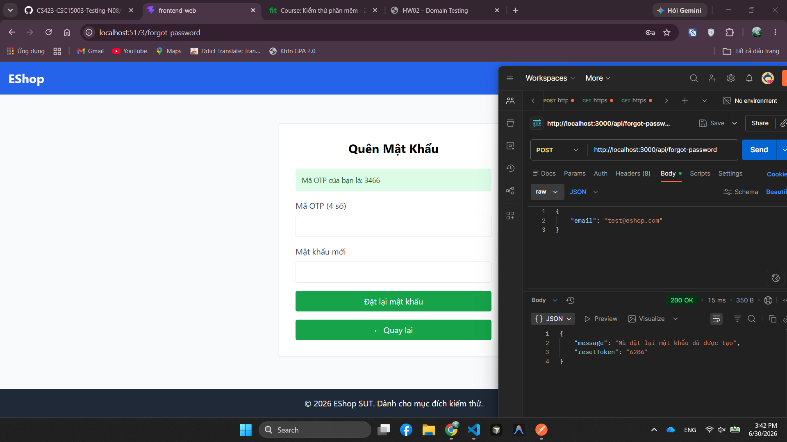

# BUG-FR03-001: OTP quên mật khẩu chỉ có 4 chữ số thay vì 6 chữ số

## Found by Test Case
TC-FR03-DT-001, TC-FR03-DT-011, TC-FR03-DT-012, TC-FR03-BVA-001, TC-FR03-BVA-002, TC-FR03-BVA-003, TC-FR03-BVA-004, TC-FR03-BVA-005, TC-FR03-BVA-006

## Requirement liên quan
FR-03: Quên mật khẩu & Đặt lại mật khẩu (2 bước)

## Severity / Priority
Major / P1

## Environment
**Browser**: Chrome 1xx  
**OS**: Ubuntu 22.04  
**Frontend URL**: http://localhost:5173  
**API URL**: http://localhost:3000  
**Build / Commit**: `c6a9ace`

## Steps to reproduce
1. Mở trang Quên mật khẩu.
2. Nhập email đã đăng ký, ví dụ `test@eshop.com`.
3. Bấm nút gửi/lấy mã OTP.
4. Quan sát OTP hiển thị trên giao diện demo.
5. Kiểm tra lại bằng API `POST /api/forgot-password` với body có email đã đăng ký.

## Expected result
Hệ thống sinh và hiển thị OTP gồm đúng 6 chữ số theo FR-03.

## Actual result
Hệ thống hiển thị OTP gồm 4 chữ số. API kiểm tra lại cũng trả `resetToken` có 4 chữ số.

## Evidence
- Tester observation: OTP hiển thị 4 chữ số trên giao diện.
- API verification: `POST /api/forgot-password` trả `200 OK` với `resetToken` dài 4 chữ số.

## Status
Open
