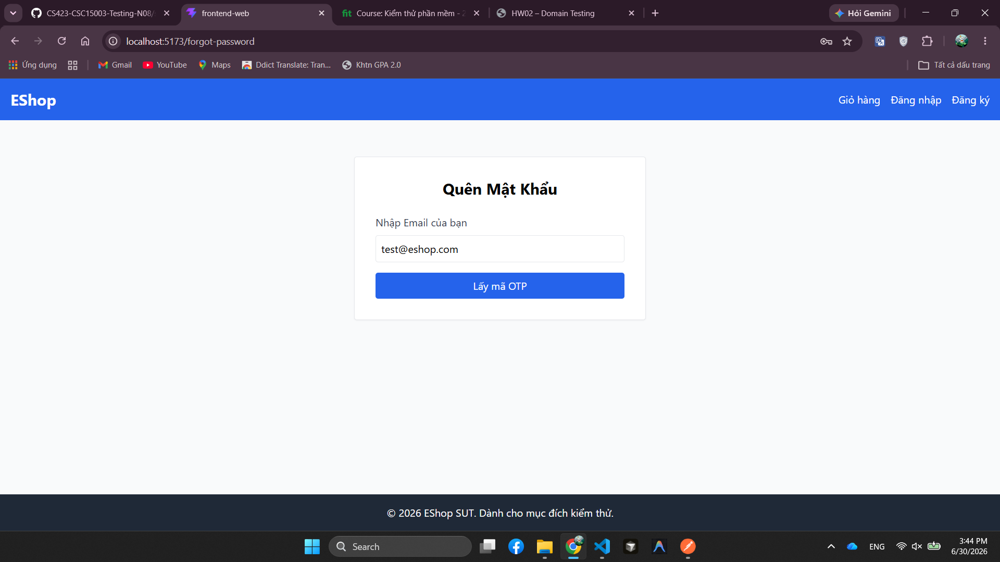

# BUG-FR03-002: Trang Quên mật khẩu không có nút Quay lại đăng nhập

## Found by Test Case
TC-FR03-DT-002

## Requirement liên quan
FR-03: Quên mật khẩu & Đặt lại mật khẩu (2 bước)

## Severity / Priority
Major / P2

## Environment
**Browser**: Chrome 1xx  
**OS**: Ubuntu 22.04  
**Frontend URL**: http://localhost:5173  
**Build / Commit**: `c6a9ace`

## Steps to reproduce
1. Mở trang Quên mật khẩu.
2. Quan sát giao diện Bước 1 của luồng lấy OTP.
3. Tìm nút hoặc liên kết Quay lại đăng nhập.

## Expected result
Giao diện có nút Quay lại đăng nhập và khi bấm sẽ điều hướng người dùng về trang Đăng nhập.

## Actual result
Giao diện không có nút Quay lại đăng nhập.

## Evidence
Tester observation trong `tests/test-runs/FR-03-forgot-password-run.md`: "Không có nút quay lại đăng nhập."

## Status
Open
