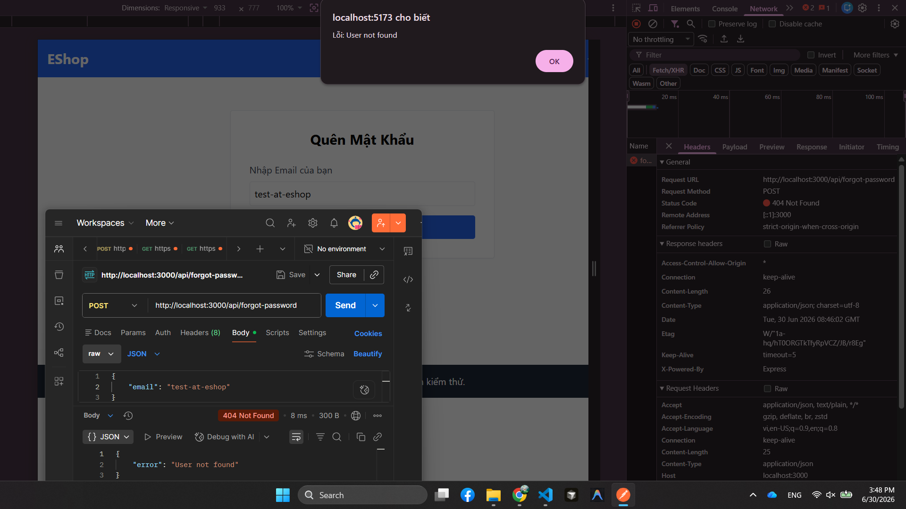

# BUG-FR03-003: Email sai định dạng trong luồng quên mật khẩu báo lỗi User not found

## Found by Test Case
TC-FR03-DT-004

## Requirement liên quan
FR-03, GUI-02

## Severity / Priority
Major / P2

## Environment
**Browser**: Chrome 1xx  
**OS**: Ubuntu 22.04  
**Frontend URL**: http://localhost:5173  
**API URL**: http://localhost:3000  
**Build / Commit**: `c6a9ace`

## Steps to reproduce
1. Mở trang Quên mật khẩu.
2. Nhập email sai định dạng, ví dụ `test-at-eshop`.
3. Bấm nút gửi/lấy mã OTP.
4. Kiểm tra lại bằng API `POST /api/forgot-password` với body `{"email":"test-at-eshop"}`.

## Expected result
Hệ thống từ chối input và hiển thị lỗi email không hợp lệ/sai định dạng; không xử lý như một email hợp lệ chưa tồn tại.

## Actual result
Hệ thống báo `User not found`. API kiểm tra lại trả `404 Not Found` với `{"error":"User not found"}`.

## Evidence
- Tester observation: giao diện báo `User not found` thay vì lỗi định dạng email.
- API verification: `POST /api/forgot-password` với email sai định dạng trả `404 User not found`.

## Status
Open
