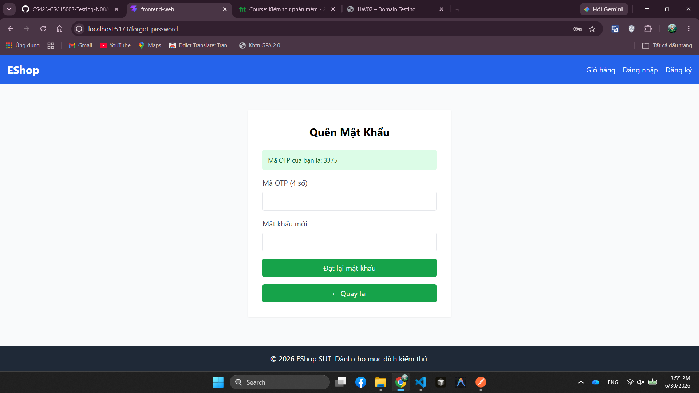

# BUG-FR03-004: Bước đặt lại mật khẩu thiếu ô Xác nhận mật khẩu mới

## Found by Test Case
TC-FR03-DT-007, TC-FR03-DT-008, TC-FR03-DT-010, TC-FR03-DT-011, TC-FR03-DT-012, TC-FR03-BVA-001, TC-FR03-BVA-002, TC-FR03-BVA-003, TC-FR03-BVA-004, TC-FR03-BVA-005, TC-FR03-BVA-006

## Requirement liên quan
FR-03, GUI-02

## Severity / Priority
Major / P1

## Environment
**Browser**: Chrome 1xx  
**OS**: Ubuntu 22.04  
**Frontend URL**: http://localhost:5173  
**Build / Commit**: `c6a9ace`

## Steps to reproduce
1. Mở trang Quên mật khẩu.
2. Nhập email đã đăng ký và lấy OTP.
3. Chuyển sang Bước 2 - Đặt lại mật khẩu.
4. Quan sát các trường nhập liệu trên form.

## Expected result
Bước 2 có đủ 3 trường: OTP, Mật khẩu mới, và Xác nhận mật khẩu mới. Hệ thống phải từ chối nếu hai trường mật khẩu không khớp.

## Actual result
Bước 2 không có ô Xác nhận mật khẩu mới, nên không thể kiểm tra rule confirm password mismatch theo FR-03.

## Evidence
Tester observation trong nhiều test case FR-03: "Không có ô xác nhận mật khẩu mới."

## Status
Open
