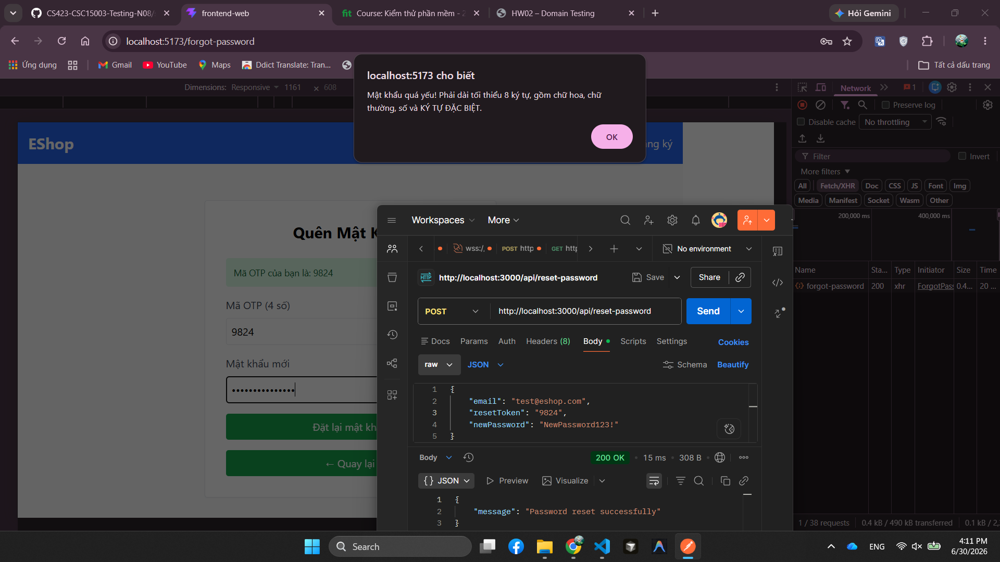

# BUG-FR03-005: Frontend quên mật khẩu từ chối mật khẩu mạnh hợp lệ và không gửi API reset

## Found by Test Case
TC-FR03-DT-006, TC-FR03-DT-008, TC-FR03-DT-009, TC-FR03-BVA-001, TC-FR03-BVA-002, TC-FR03-BVA-003, TC-FR03-BVA-005, TC-FR03-BVA-006

## Requirement liên quan
FR-03, FR-01

## Severity / Priority
Critical / P1

## Environment
**Browser**: Chrome 1xx  
**OS**: Ubuntu 22.04  
**Frontend URL**: http://localhost:5173  
**API URL**: http://localhost:3000  
**Build / Commit**: `c6a9ace`

## Steps to reproduce
1. Mở trang Quên mật khẩu.
2. Lấy OTP cho email đã đăng ký.
3. Ở Bước 2, nhập OTP hợp lệ.
4. Nhập mật khẩu mới hợp lệ theo FR-01, ví dụ `NewPass123!`, `BvaPass123!`, `Ab1!abcd`, hoặc `Ab1!abcde`.
5. Bấm nút đặt lại mật khẩu.
6. Quan sát thông báo lỗi và network/API request.
7. Kiểm tra lại trực tiếp bằng API `POST /api/reset-password` với OTP hợp lệ và mật khẩu mạnh.

## Expected result
Frontend chấp nhận mật khẩu mạnh hợp lệ, gửi request reset password tới backend, và hệ thống đặt lại mật khẩu thành công nếu OTP đúng.

## Actual result
Frontend báo lỗi "Mật khẩu quá yếu! Phải dài tối thiểu 8 ký tự, gồm chữ hoa, chữ thường, số và KÝ TỰ ĐẶC BIỆT." dù mật khẩu đã thỏa rule FR-01; tester không thấy API reset được gửi đi. Kiểm tra trực tiếp bằng API cho thấy backend chấp nhận mật khẩu mạnh hợp lệ và reset thành công, nên lỗi nằm ở validation phía frontend.

## Evidence
- Tester observation: nhiều mật khẩu mạnh bị frontend báo yếu.
- API verification: `POST /api/reset-password` với OTP hợp lệ và `NewPass123!` trả `200 OK` / `Password reset successfully`.
- Sau khi kiểm tra API, mật khẩu mặc định của `test@eshop.com` đã được khôi phục về `Test1234!`.

## Status
Open
