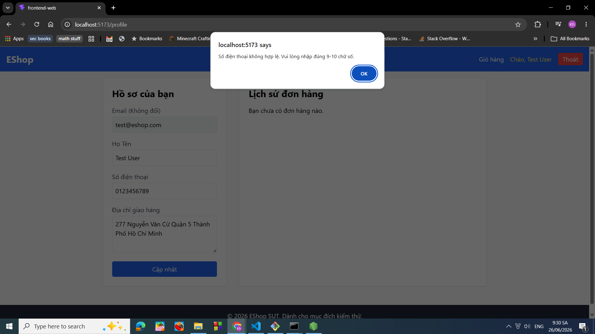

# BUG-FR04-INFO-001: Hệ thống từ chối cập nhật thông tin cá nhân hợp lệ

## Found by Test Case

TC-FR04-INFO-001

## Requirement liên quan

FR-04 Personal profile management

## Severity / Priority

Major / High

## Environment

Windows 10, Google Chrome Version 149.0.7827.103

## Steps to reproduce

1. Chạy chương trình backend, frontend web, frontend admin
2. Truy cập vào trang web với đường dẫn [http://localhost:5173/](http://localhost:5173/)
3. Nhấn vào mục đăng nhập
4. Đăng nhập với tên email: [test@eshop.com](mailto:test@eshop.com) và mật khẩu là Test1234!
5. Nhấn vào mục "Chào, Test User" (đường dẫn là: [http://localhost:5173/profile](http://localhost:5173/profile))
6. Chọn vào ô nhập số điện thoại và nhập số: 0123456789
7. Chọn vào ô nhập địa chỉ giao hàng và nhập: 277 Nguyễn Văn Cừ Quận 5 Thành Phố Hồ Chí Minh
8. Nhấn vào nút cập nhật

## Expected result

Hệ thống ghi nhận yêu cầu của người dùng, không thông báo lỗi

## Actual result

Hệ thống từ chối cập nhật thông tin cá nhân và hiển thị thông báo lỗi về số điện thoại không hợp lệ.

## Evidence

