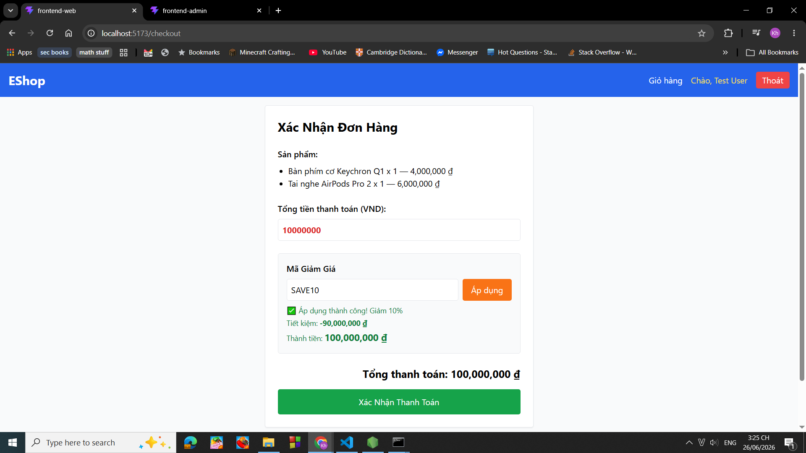
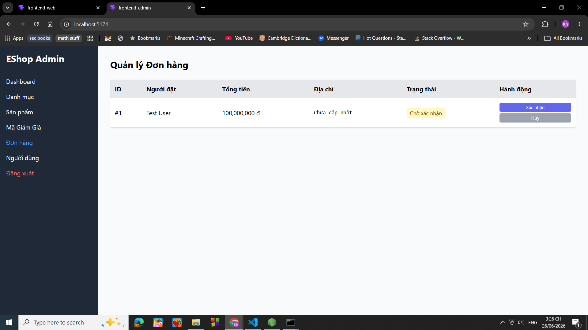

# BUG-FR09-DISCOUNT-004: Mã giảm giá không được áp dụng đúng cho giỏ hàng nhiều sản phẩm

## Found by Test Case

TC-FR09-DISCOUNT-004

## Requirement liên quan

FR-09 Discount coupons

## Severity / Priority

Major / P1

## Environment

Windows 10, Google Chrome Version 149.0.7827.103

## Steps to reproduce

1. Chạy chương trình backend, frontend web, frontend admin
2. Truy cập vào trang web với đường dẫn [http://localhost:5173/](http://localhost:5173/)
3. Nhấn vào mục đăng nhập
4. Đăng nhập với tên email: [test@eshop.com](mailto:test@eshop.com) và mật khẩu là Test1234!
5. Thêm vào giỏ hàng sản phẩm: Bàn phím cơ Keychron Q1 và sản phẩm: Tai nghe AirPods Pro 2
6. Nhấn vào mục: Giỏ hàng
7. Nhấn vào mục: Tiến hành thanh toán
8. Nhập vào ô Mã giảm giá mã: SAVE10
9. Nhấn vào Áp dụng
10. Nhấn vào Xác nhận thanh toán

## Expected result

Sau bước 8, giao diện hiện đơn hàng là 9000000

Sau bước 9, hệ thống xác nhận và hiện trên trang admin đơn hàng giá trị 9000000

## Actual result

Sau khi ap dụng mã giảm giá, hệ thống áp dụng sai (áp dụng -9000000 (âm chín chục triệu) thay vì 10000000 * 10% = 1000000 (một triệu)) dẫn tới hệ thống ghi nhận sản phẩm 100000000 (một trăm triệu đồng)

## Evidence

Ảnh áp dụng mã giảm giá trên giao diện web:

Ảnh đơn hàng trên giao diện của admin:

