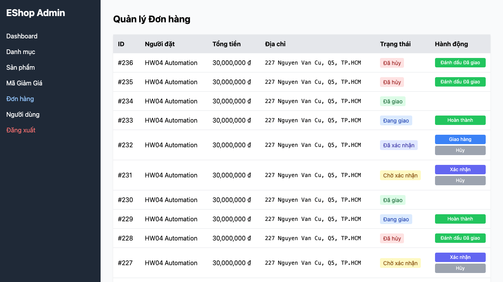

# BUG-FR10-001: Đơn đã hủy (canceled) vẫn chuyển được sang "Đã giao"

## Found by Test Case
F10-TC-009 — "F10-TC-009 — Đơn đã hủy là trạng thái kết thúc"

## Requirement liên quan
FR-10 — `sut-requirements.md` §3: `canceled` là trạng thái kết thúc, không có chuyển đổi nào đi ra từ đó.

## Severity / Priority
Critical / P1

## Environment
**Browser**: Chromium 151.0.7922.34 (Playwright 1.62.1)
**OS**: macOS 26.5.2 (Tahoe)
**URL**: Frontend Admin `http://localhost:5174`
**Ngày thực thi**: 08/08/2026

## Steps to reproduce
1. Đăng nhập Admin, mở mục Đơn hàng.
2. Tìm một đơn ở trạng thái "Đã hủy".
3. Quan sát các nút hành động hiển thị trên dòng đơn đó.
4. Bấm nút "Đánh dấu Đã giao" nếu có.

## Expected result
Dòng đơn "Đã hủy" không hiển thị bất kỳ nút chuyển trạng thái nào, vì đây là trạng thái kết thúc theo đặc tả.

## Actual result
Dòng đơn "Đã hủy" hiển thị nút "Đánh dấu Đã giao". Bấm vào nút này chuyển đơn sang trạng thái "Đã giao" thành công.

## Evidence

## Duplicate check
Không tìm thấy bug report `BUG-FR10-*` nào khác trong `bug-reports/` của HW04 trước khi tạo report này. Cùng dạng lỗi với `BUG-FR10-001` của HW02.
