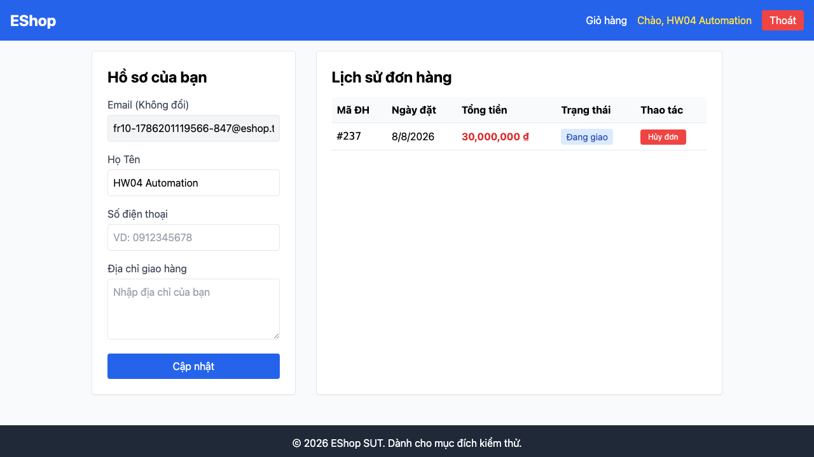

# BUG-FR10-002: User vẫn hủy được đơn đang ở trạng thái "Đang giao"

## Found by Test Case
F10-TC-010 — "F10-TC-010 — User không được tự hủy đơn đang giao"

## Requirement liên quan
FR-10 — `sut-requirements.md` §3: từ trạng thái `shipping`, chỉ Admin được thao tác; User không được tự hủy.

## GitHub Issue
https://github.com/lmchkhi/CS423-CSC15003-Testing-N08/issues/209

## Severity / Priority
Major / P1

## Environment
**Browser**: Chromium 151.0.7922.34 (Playwright 1.62.1)
**OS**: macOS 26.5.2 (Tahoe)
**URL**: Frontend Web `http://localhost:5173`, Frontend Admin `http://localhost:5174`
**Ngày thực thi**: 08/08/2026

## Steps to reproduce
1. Đăng nhập bằng tài khoản User, tạo một đơn hàng.
2. Đăng nhập Admin, chuyển đơn đó lần lượt sang "Đã xác nhận" rồi "Đang giao".
3. Quay lại phiên User, mở trang lịch sử đơn hàng.
4. Quan sát nút trên dòng đơn "Đang giao"; bấm nút "Hủy đơn" nếu có.

## Expected result
Dòng đơn "Đang giao" không hiển thị nút "Hủy đơn" cho User.

## Actual result
Nút "Hủy đơn" vẫn hiển thị cho User; bấm vào hủy đơn thành công, đơn chuyển sang "Đã hủy".

## Evidence

## Duplicate check
Không tìm thấy bug report `BUG-FR10-*` nào khác trong `bug-reports/` của HW04 trước khi tạo report này (ngoài `BUG-FR10-001` vừa lập, khác case). Cùng dạng lỗi với `BUG-FR10-002` của HW02.
