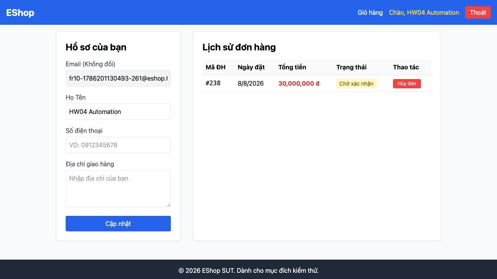

# BUG-FR10-003: Phiên User thường đổi được trạng thái đơn hàng qua endpoint quản trị

## Found by Test Case
F10-TC-011 — "F10-TC-011 — Phiên User thường không được đổi trạng thái đơn hàng"

## Requirement liên quan
FR-10 kết hợp FR-12 — `sut-requirements.md` §3 và §5: đổi trạng thái đơn hàng là đặc quyền Admin; mọi API `/api/admin/*` phải yêu cầu token hợp lệ và `role = 'admin'`.

## GitHub Issue
https://github.com/lmchkhi/CS423-CSC15003-Testing-N08/issues/210

## Severity / Priority
Critical / P0

## Environment
**Browser**: Chromium 151.0.7922.34 (Playwright 1.62.1)
**OS**: macOS 26.5.2 (Tahoe)
**URL**: Frontend Web `http://localhost:5173`, API `http://localhost:3000`
**Ngày thực thi**: 08/08/2026

## Steps to reproduce
1. Đăng nhập bằng tài khoản User thường, tạo một đơn hàng của chính mình.
2. Mở DevTools → Console trong phiên trình duyệt của User đó (không đăng xuất).
3. Từ Console, gửi trực tiếp một request `PUT` tới endpoint đổi trạng thái đơn hàng phía quản trị, kèm theo token hiện có của phiên User (đọc từ `localStorage`), yêu cầu đổi đơn vừa tạo sang một trạng thái bất kỳ.
4. Quan sát response của request và trạng thái đơn hàng sau đó.

## Expected result
Request bị từ chối vì token không có `role = 'admin'`; trạng thái đơn hàng không đổi.

## Actual result
Request thành công (response 2xx); trạng thái đơn hàng đổi theo đúng yêu cầu, dù được gửi từ phiên đăng nhập của một User thường.

## Evidence

## Duplicate check
Không tìm thấy bug report `BUG-FR10-*` nào khác trong `bug-reports/` của HW04 trước khi tạo report này (ngoài `BUG-FR10-001`/`002` vừa lập, khác case). Cùng dạng lỗi với `BUG-FR10-003` của HW02.
