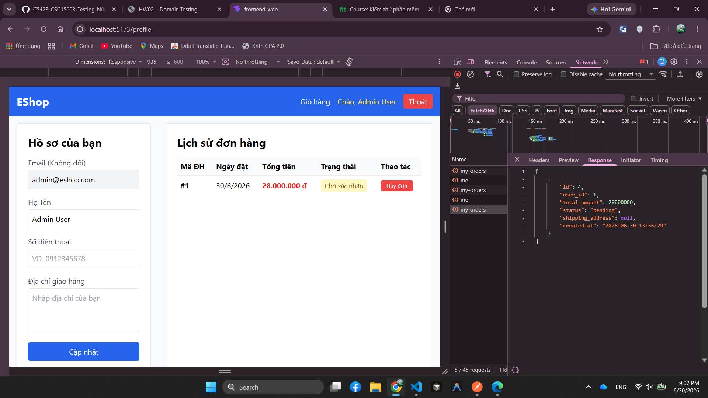
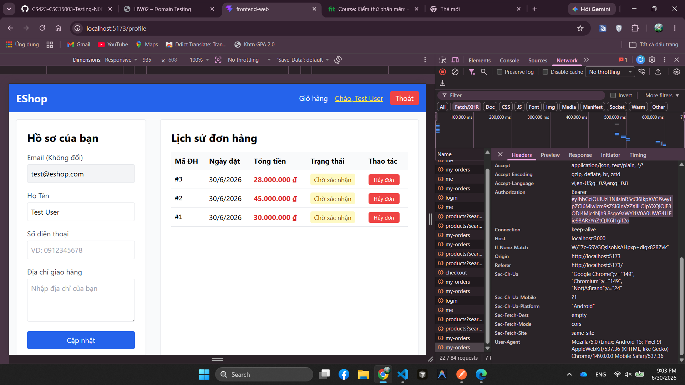
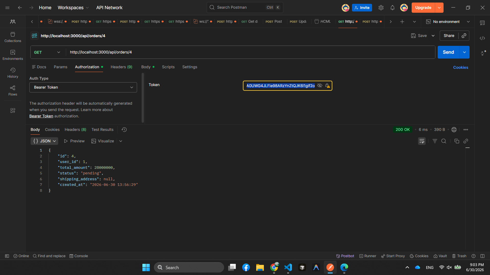

# BUG-FR11-007: User thường truy cập được chi tiết đơn hàng của user khác qua API

## Found by Test Case
TC-FR11-DT-007

## Requirement liên quan
FR-11: Xem lịch sử đơn hàng (User)

## Severity / Priority
Critical / P1

## Environment
**Browser**: Chrome 1xx  
**OS**: Ubuntu 22.04  
**Frontend URL**: http://localhost:5173  
**Admin URL**: http://localhost:5174  
**API URL**: http://localhost:3000  
**Build / Commit**: `fd83b42`

## Steps to reproduce
1. Đăng nhập bằng user thường `test@eshop.com`.
2. Chuẩn bị hoặc xác định một đơn hàng thuộc user khác, ví dụ đơn `#4` thuộc `user_id = 1`.
3. Gọi API `GET /api/orders/4` với Bearer token của `test@eshop.com`.
4. Quan sát HTTP status và body response.

## Expected result
API phải từ chối truy cập vì đơn hàng `#4` không thuộc user đang đăng nhập; response không được trả thông tin chi tiết của đơn hàng user khác.

## Actual result
API trả `200 OK` và body chứa chi tiết đơn hàng `#4` với `user_id = 1`, trong khi token đang dùng thuộc user thường `test@eshop.com` (`user_id = 2`).

## Evidence
- Tester observation: gọi `GET /api/orders/<other_user_order_id>` bằng user thường vẫn truy cập được dữ liệu đơn của user khác.
- API verification: `GET /api/orders/4` với token của `test@eshop.com` trả `200 OK`, `returned_id = 4`, `returned_user_id = 1`.
- Screenshot dữ liệu đơn `#4` thuộc account Admin:

- Screenshot dữ liệu các đơn hàng thuộc account test:

- Screenshot API response khi gọi `GET /api/orders/4` bằng token của `test@eshop.com`:

## Status
Open
