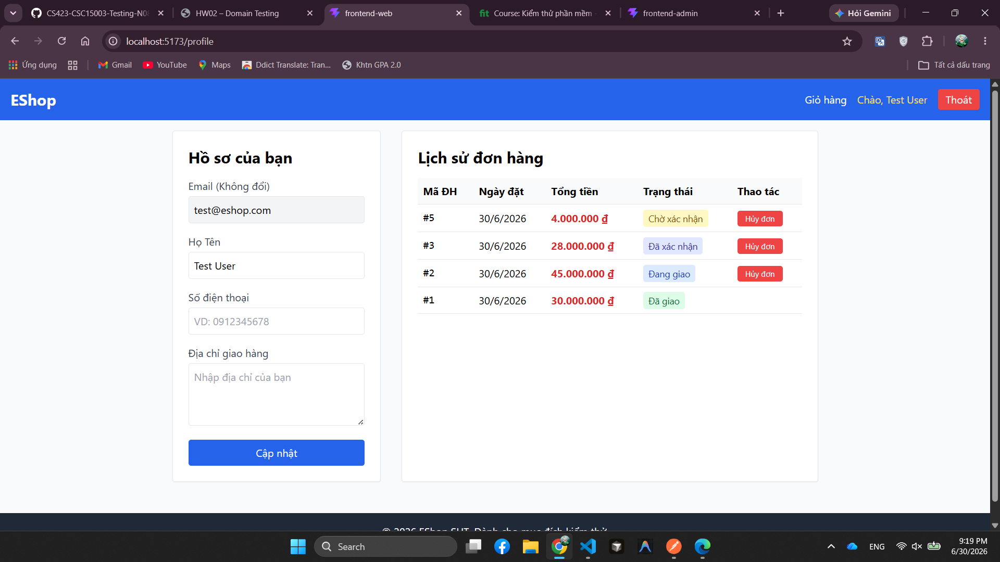

# BUG-FR11-012: Màu trạng thái Đã xác nhận và Đang giao khó phân biệt

## Found by Test Case
TC-FR11-DT-012

## Requirement liên quan
FR-11: Xem lịch sử đơn hàng (User)

## Severity / Priority
Minor / P3

## Environment
**Browser**: Chrome 1xx  
**OS**: Ubuntu 22.04  
**Frontend URL**: http://localhost:5173  
**API URL**: http://localhost:3000  
**Build / Commit**: `fd83b42`

## Steps to reproduce
1. Đăng nhập Web bằng `test@eshop.com`.
2. Chuẩn bị danh sách lịch sử đơn hàng có ít nhất hai trạng thái `confirmed` và `shipping`.
3. Mở trang Hồ sơ/Lịch sử đơn hàng.
4. Quan sát màu badge của trạng thái `Đã xác nhận` và `Đang giao`.

## Expected result
Các trạng thái đơn hàng phải được phân biệt bằng màu sắc rõ ràng để user nhận biết nhanh trạng thái hiện tại của từng đơn.

## Actual result
Badge `Đã xác nhận` và `Đang giao` đều dùng tông xanh lam gần nhau; `Đã xác nhận` chỉ đậm hơn một chút nên khó phân biệt trạng thái bằng màu sắc.

## Evidence
- Tester observation: hai trạng thái `Đã xác nhận` và `Đang giao` khó phân biệt bằng màu.

## Status
Open
