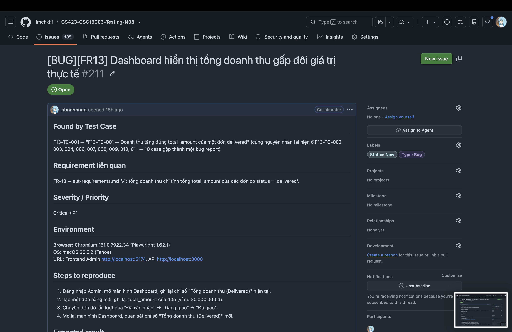
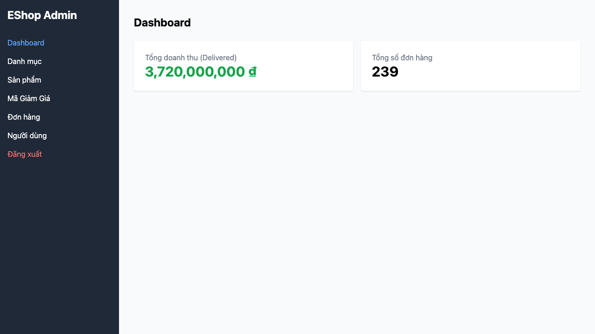

# BUG-FR13-001: Dashboard hiển thị tổng doanh thu gấp đôi giá trị thực tế

## Found by Test Case
F13-TC-001 — "F13-TC-001 — Doanh thu tăng đúng total_amount của một đơn delivered" (cùng nguyên nhân tái hiện ở F13-TC-002, F13-TC-003, F13-TC-004, F13-TC-006, F13-TC-007, F13-TC-008, F13-TC-009, F13-TC-010, F13-TC-011 — 10 case trên cùng một lỗi, gộp thành một bug report theo hướng dẫn của skill `bug-report`)

## Requirement liên quan
FR-13 — `sut-requirements.md` §4: tổng doanh thu chỉ tính tổng `total_amount` của các đơn có `status = 'delivered'`.

## GitHub Issue
https://github.com/lmchkhi/CS423-CSC15003-Testing-N08/issues/211

## Severity / Priority
Critical / P1

## Environment
**Browser**: Chromium 151.0.7922.34 (Playwright 1.62.1)
**OS**: macOS 26.5.2 (Tahoe)
**URL**: Frontend Admin `http://localhost:5174`, API `http://localhost:3000`
**Ngày thực thi**: 08/08/2026

## Steps to reproduce
1. Đăng nhập Admin, mở màn hình Dashboard, ghi lại chỉ số "Tổng doanh thu (Delivered)" hiện tại.
2. Tạo một đơn hàng mới, ghi lại `total_amount` của đơn (ví dụ `30.000.000 đ`).
3. Chuyển đơn đó lần lượt qua "Đã xác nhận" → "Đang giao" → "Đã giao".
4. Mở lại màn hình Dashboard, quan sát chỉ số "Tổng doanh thu (Delivered)" mới.

## Expected result
Doanh thu tăng đúng bằng `total_amount` của đơn vừa chuyển sang "Đã giao" (ví dụ tăng `30.000.000 đ`).

## Actual result
Doanh thu tăng gấp đúng **2 lần** `total_amount` của đơn đó (ví dụ tăng `60.000.000 đ` thay vì `30.000.000 đ`). Đối chiếu độc lập với tổng tính trực tiếp từ `GET /api/admin/orders` (lọc `status = 'delivered'`, cộng `total_amount`) cho kết quả đúng bằng phân nửa số Dashboard hiển thị — số đơn hàng (`Tổng số đơn hàng`) thì chính xác, chỉ riêng doanh thu bị nhân đôi. Hệ số nhân đôi này lặp lại nhất quán ở mọi tổ hợp dữ liệu đã thử (1 đơn delivered, nhiều đơn delivered, dữ liệu trộn nhiều trạng thái) và trên cả ba trình duyệt. Đây là cùng dạng lỗi với `BUG-FR13-001` ghi nhận ở HW02 (khi đó số đo cụ thể cũng là gấp đúng 2 lần), tức là lỗi đã tồn tại từ trước và chưa được sửa trên bản build hiện tại.

## Evidence

## Duplicate check
Không tìm thấy bug report `BUG-FR13-*` nào khác trong `bug-reports/` của HW04 trước khi tạo report này. Cùng số hiệu với `BUG-FR13-001` của HW02 do trùng chính lỗi đó (không phải chủ ý đánh số theo HW02 — bộ đếm HW04 độc lập, trùng số là ngẫu nhiên vì đây cũng là bug đầu tiên của FR-13 trong HW04).
