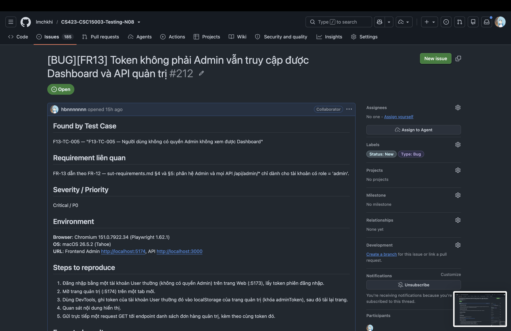
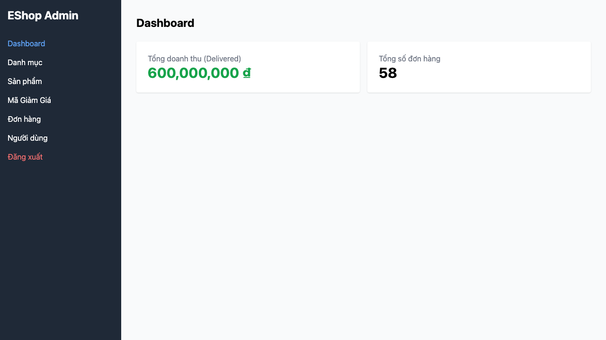

# BUG-FR13-002: Token của tài khoản không phải Admin vẫn truy cập được Dashboard và API quản trị

## Found by Test Case
F13-TC-005 — "F13-TC-005 — Người dùng không có quyền Admin không xem được Dashboard"

## Requirement liên quan
FR-13 dẫn theo FR-12 — `sut-requirements.md` §4 và §5: phân hệ Admin và mọi API `/api/admin/*` chỉ dành cho tài khoản có `role = 'admin'`.

## GitHub Issue
https://github.com/lmchkhi/CS423-CSC15003-Testing-N08/issues/212

## Severity / Priority
Critical / P0

## Environment
**Browser**: Chromium 151.0.7922.34 (Playwright 1.62.1)
**OS**: macOS 26.5.2 (Tahoe)
**URL**: Frontend Admin `http://localhost:5174`, API `http://localhost:3000`
**Ngày thực thi**: 08/08/2026

## Steps to reproduce
1. Đăng nhập bằng một tài khoản User thường (không có quyền Admin) trên trang Web (`:5173`), lấy token phiên đăng nhập.
2. Mở trang quản trị (`:5174`) trên một tab mới.
3. Dùng DevTools, ghi token của tài khoản User thường đó vào `localStorage` của trang quản trị (khóa `adminToken`), sau đó tải lại trang.
4. Quan sát nội dung hiển thị.
5. Gửi trực tiếp một request `GET` tới endpoint danh sách đơn hàng quản trị, kèm theo cùng token đó.

## Expected result
Trang quản trị từ chối hiển thị Dashboard (quay về màn hình đăng nhập Admin, không hiển thị số liệu nào); request tới API quản trị bị từ chối.

## Actual result
Trang quản trị hiển thị Dashboard đầy đủ số liệu doanh thu và số đơn hàng, y hệt như một phiên Admin hợp lệ. Request `GET` tới API quản trị trả về `200` kèm dữ liệu đơn hàng thật, không phải lỗi từ chối quyền.

## Evidence

## Duplicate check
Không tìm thấy bug report `BUG-FR13-*` nào khác trong `bug-reports/` của HW04 trước khi tạo report này (ngoài `BUG-FR13-001` vừa lập, khác lỗi — một lỗi tính toán doanh thu, một lỗi phân quyền). Không có bug tương ứng ở HW02 — HW02 kiểm tra case này bằng cách đăng nhập qua form Admin Login (bị chặn ở đó vì endpoint đăng nhập Admin riêng có kiểm tra role), nên chưa từng phát hiện rằng bản thân trang quản trị và API `/api/admin/*` không tái kiểm tra role khi token được đưa vào bằng đường khác.
