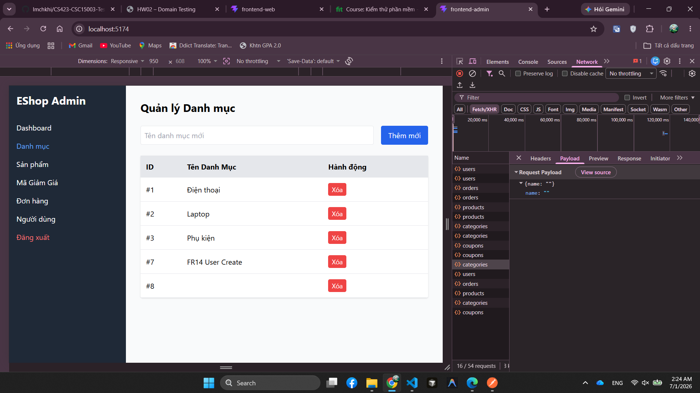
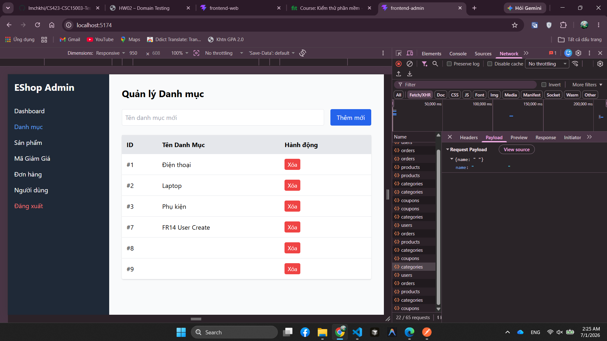
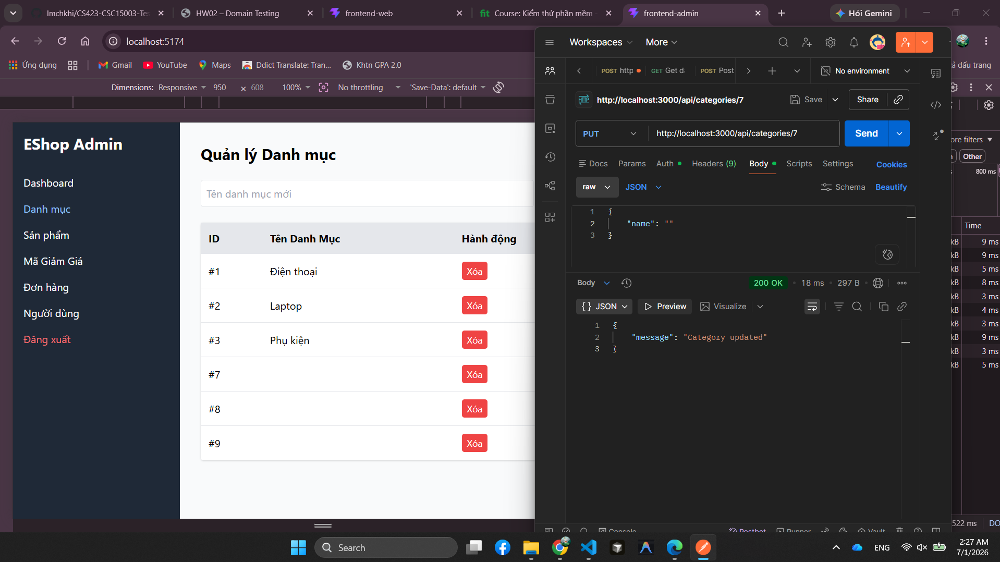

# BUG-FR14-002: API danh mục không validate tên bắt buộc khi thêm hoặc cập nhật

## Found by Test Case
TC-FR14-DT-007, TC-FR14-DT-008, TC-FR14-DT-011, TC-FR14-BVA-001

## Requirement liên quan
FR-14

## Severity / Priority
Major / P1

## Environment
**Browser**: Chrome 1xx  
**OS**: Ubuntu 22.04  
**Admin URL**: http://localhost:5174  
**API URL**: http://localhost:3000  
**Build / Commit**: `5164f72`

## Steps to reproduce
1. Đăng nhập bằng admin `admin@eshop.com`.
2. Gọi `POST /api/categories` với body `{"name":""}`.
3. Gọi `POST /api/categories` với body `{"name":"   "}`.
4. Tạo hoặc chọn một category test, sau đó gọi `PUT /api/categories/<category_id>` với body `{"name":""}`.
5. Quan sát HTTP status, response body và danh sách danh mục.

## Expected result
Hệ thống phải từ chối tên danh mục rỗng hoặc chỉ gồm khoảng trắng vì FR-14 quy định tên danh mục là bắt buộc, không được để trống. Khi cập nhật, tên cũ phải được giữ nguyên nếu tên mới invalid.

## Actual result
API vẫn trả `200 OK` và báo thành công khi thêm/cập nhật category với tên rỗng hoặc chỉ gồm khoảng trắng. Hệ thống có thể tạo/cập nhật category thành tên trống.

## Evidence
- Tester observation: admin vẫn tạo được category với tên rỗng và tên chỉ gồm khoảng trắng; admin cũng cập nhật được category thành tên rỗng.
- API verification: `POST /api/categories` với `{"name":""}` trả `200 OK`, `Category created`, id `8`.

- API verification: `POST /api/categories` với `{"name":"   "}` trả `200 OK`, `Category created`, id tạm `9`.

- API verification: `PUT /api/categories/7` với `{"name":""}` trả `200 OK`, `Category updated`.

- Dữ liệu tạm tạo trong lúc kiểm tra đã được dọn; danh sách category quay về 3 category mặc định.

## Status
Open
