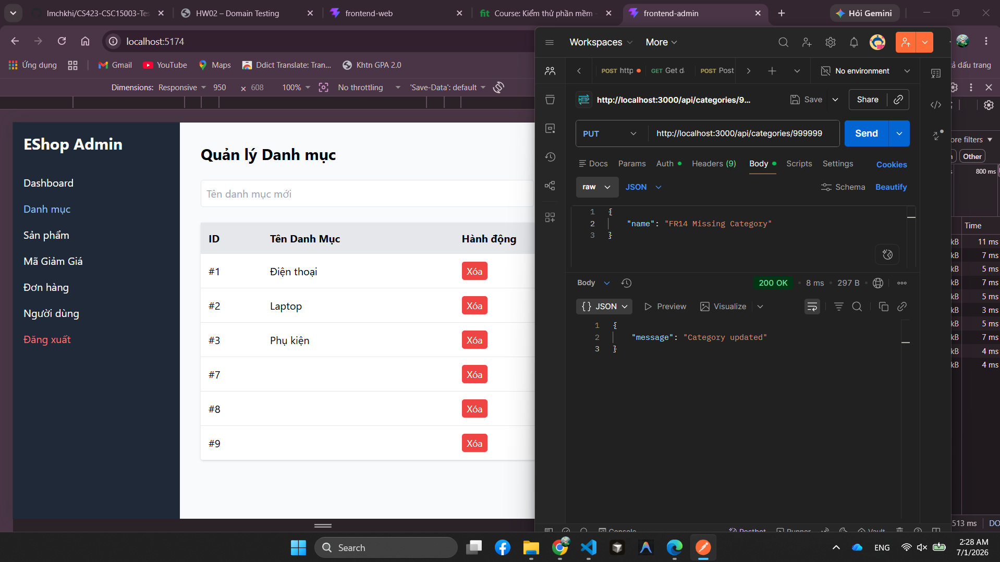
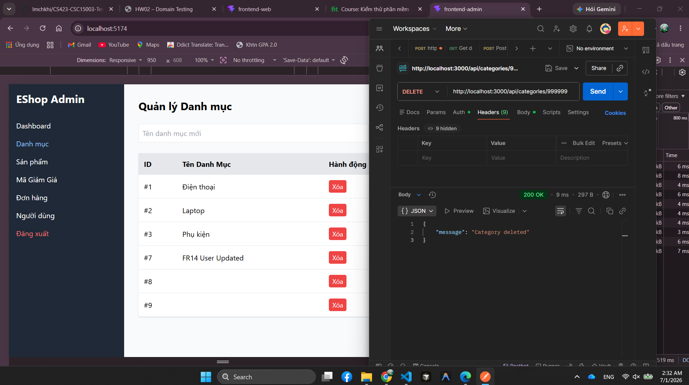

# BUG-FR14-003: API cập nhật/xóa danh mục không tồn tại vẫn trả thông báo thành công

## Found by Test Case
TC-FR14-DT-012, TC-FR14-DT-015

## Requirement liên quan
FR-14

## Severity / Priority
Major / P2

## Environment
**Browser**: Chrome 1xx  
**OS**: Ubuntu 22.04  
**Admin URL**: http://localhost:5174  
**API URL**: http://localhost:3000  
**Build / Commit**: `5164f72`

## Steps to reproduce
1. Đăng nhập bằng admin `admin@eshop.com`.
2. Xác định một category id không tồn tại, ví dụ `999999`.
3. Gọi `PUT /api/categories/999999` với body `{"name":"FR14_VERIFY_MISSING"}`.
4. Gọi `DELETE /api/categories/999999`.
5. Quan sát HTTP status, response body và danh sách danh mục.

## Expected result
API phải trả lỗi phù hợp như `404 Not Found` hoặc thông báo category không tồn tại; hệ thống không được báo cập nhật/xóa thành công khi không có record nào bị ảnh hưởng.

## Actual result
API trả `200 OK` với message thành công dù category id không tồn tại:
- `PUT /api/categories/999999` trả `{"message":"Category updated"}`.
- `DELETE /api/categories/999999` trả `{"message":"Category deleted"}`.

## Evidence
- Tester observation: update/delete id không tồn tại vẫn báo `200 OK`.
- API verification: `PUT /api/categories/999999` trả `200 OK`, `Category updated`, nhưng không có category nào được tạo/cập nhật.

- API verification: `DELETE /api/categories/999999` trả `200 OK`, `Category deleted`, dù id không tồn tại.

## Status
Open
