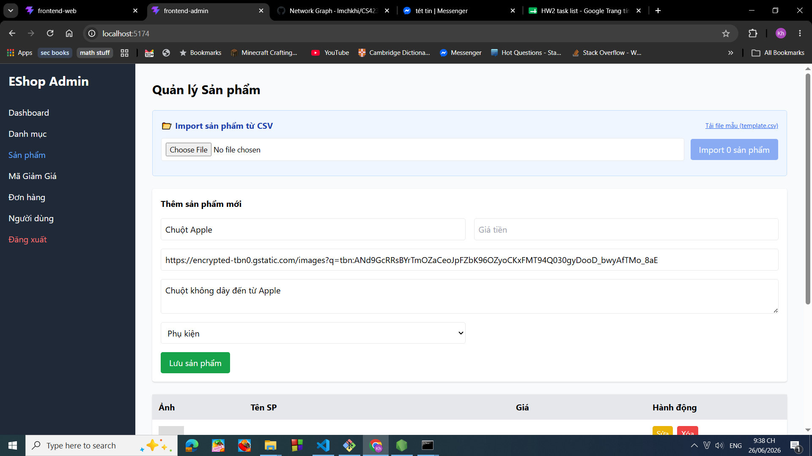
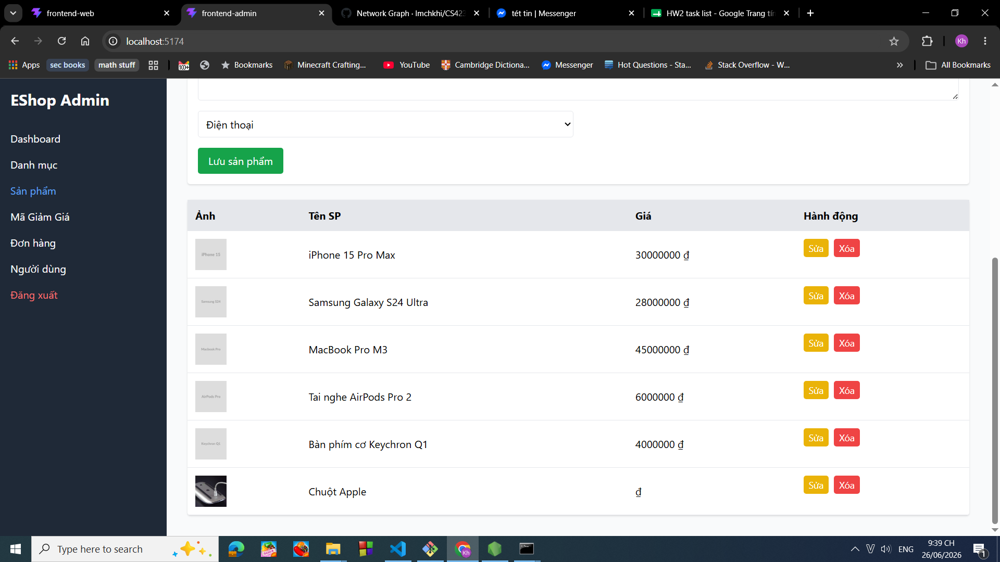
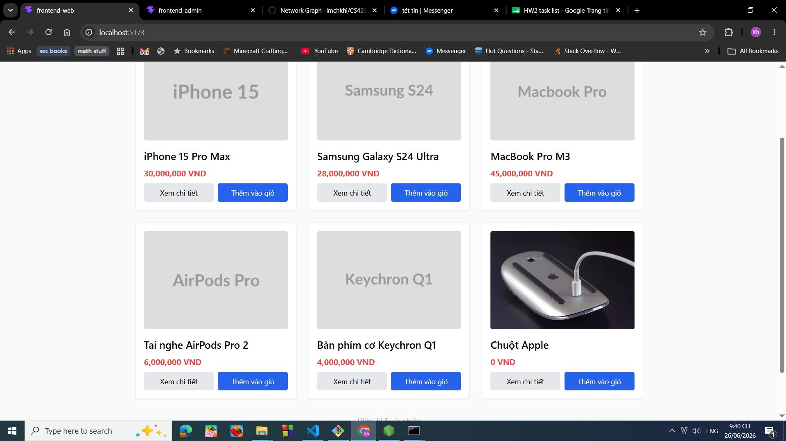

# BUG-FR15-PRODUCTADD-004: Hệ thống cho phép tạo sản phẩm không có giá

## Found by Test Case

TC-FR15-ProductAdd-004

## Requirement liên quan

FR-15 Product management (CRUD)

## Severity / Priority

Major / P2

## Environment

Windows 10, Google Chrome Version 149.0.7827.103

## Steps to reproduce

1. Chạy chương trình backend, frontend web, frontend admin
2. Truy cập vào trang web admin với đường dẫn [http://localhost:5174/](http://localhost:5174/)
3. Đăng nhập với tên email: [admin@eshop.com](mailto:admin@eshop.com) và mật khẩu là Admin123!
4. Nhấn vào mục: Sản phẩm
5. Điền vào mục Tên sản phẩm giá trị Chuột Apple
6. Điền vào mục URL ảnh giá trị [https://encrypted-tbn0.gstatic.com/images?q=tbn:ANd9GcRRsBYrTmOZaCeoJpFZbK96OZyoCKxFMT94Q030gyDooD_bwyAfTMo_8aE](https://encrypted-tbn0.gstatic.com/images?q=tbn:ANd9GcRRsBYrTmOZaCeoJpFZbK96OZyoCKxFMT94Q030gyDooD_bwyAfTMo_8aE)
7. Điền vào mục Mô tả: Chuột không dây đến từ Apple
8. Chọn vào mục ghi "Điện thoại" và chỉnh lại thành giá trị "Phụ kiện"
9. Nhấn vào nút lưu sản phẩm.
10. Truy cập vào trang web người dùng với đường dẫn [http://localhost:5173/](http://localhost:5173/)

## Expected result

Sau khi thực hiện bước 8:

- Hệ thống không ghi nhận sản phẩm và thông báo lỗi vì không có giá sản phẩm
- Giao diện của admin không hiện ra sản phẩm mới tạo

Sau khi thực hiện bước 9:

- Giao diện của người dùng không có sản phẩm mới tạo

## Actual result

Hệ thống vẫn ghi nhận sản phẩm và hiển thị sản phẩm với giá rỗng.

Giao diện người dùng cũng hiển thị sản phẩm với giá bằng 0.

## Evidence

Ảnh trước khi tạo sản phẩm:

Ảnh sau khi tạo sản phẩm:

Ảnh giao diện khi truy cập vào trang web người dùng:

