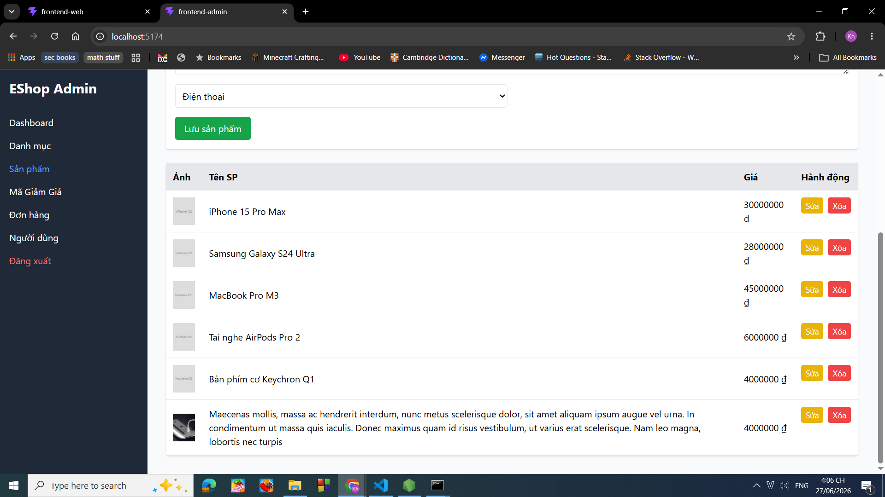
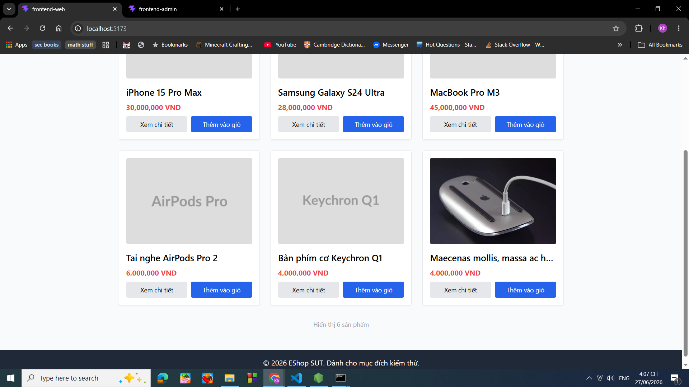
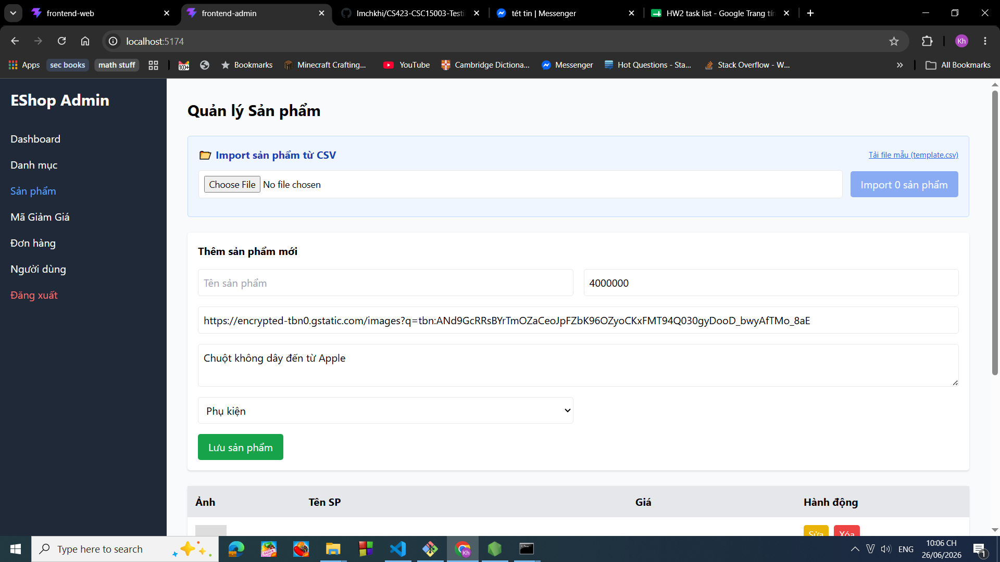

# BUG-FR15-PRODUCTADD-005: Hệ thống cho phép tạo sản phẩm với tên quá dài

## Found by Test Case

TC-FR15-ProductAdd-005

## Requirement liên quan

FR-15 Product management (CRUD)

## Severity / Priority

Minor / P2

## Environment

Windows 10, Google Chrome Version 149.0.7827.103

## Steps to reproduce

1. Chạy chương trình backend, frontend web, frontend admin
2. Truy cập vào trang web admin với đường dẫn [http://localhost:5174/](http://localhost:5174/)
3. Đăng nhập với tên email: [admin@eshop.com](mailto:admin@eshop.com) và mật khẩu là Admin123!
4. Nhấn vào mục: Sản phẩm
5. Điền vào mục Tên sản phẩm giá trị: Maecenas mollis, massa ac hendrerit interdum, nunc metus scelerisque dolor, sit amet aliquam ipsum augue vel urna. In condimentum ut massa quis iaculis. Donec maximus quam id risus vestibulum, ut varius erat scelerisque. Nam leo magna, lobortis nec turpis.
6. Điền vào mục Giá tiền 4000000
7. Điền vào mục URL ảnh giá trị [https://encrypted-tbn0.gstatic.com/images?q=tbn:ANd9GcRRsBYrTmOZaCeoJpFZbK96OZyoCKxFMT94Q030gyDooD_bwyAfTMo_8aE](https://encrypted-tbn0.gstatic.com/images?q=tbn:ANd9GcRRsBYrTmOZaCeoJpFZbK96OZyoCKxFMT94Q030gyDooD_bwyAfTMo_8aE)
8. Điền vào mục Mô tả: Chuột không dây đến từ Apple
9. Chọn vào mục ghi "Điện thoại" và chỉnh lại thành giá trị "Phụ kiện"
10. Nhấn vào nút lưu sản phẩm.
11. Truy cập vào trang web người dùng với đường dẫn [http://localhost:5173/](http://localhost:5173/)

## Expected result

Sau khi thực hiện bước 9:

- Hệ thống không ghi nhận sản phẩm và thông báo lỗi tên sản phẩm quá dài
- Giao diện của admin không thể hiện ra sản phẩm mới tạo

Sau khi thực hiện bước 10:

- Giao diện của người dùng không thể hiện sản phẩm mới tạo

## Actual result

Hệ thống vẫn ghi nhận sản phẩm và hiển thị sản phẩm với tên quá dài.

Giao diện vẫn hiện thông tin sản phẩm với tên quá dài trên giao diện người dùng.

## Evidence

Ảnh trước khi tạo sản phẩm:

Ảnh sau khi tạo sản phẩm:

Ảnh giao diện người dùng sau khi tạo sản phẩm:

