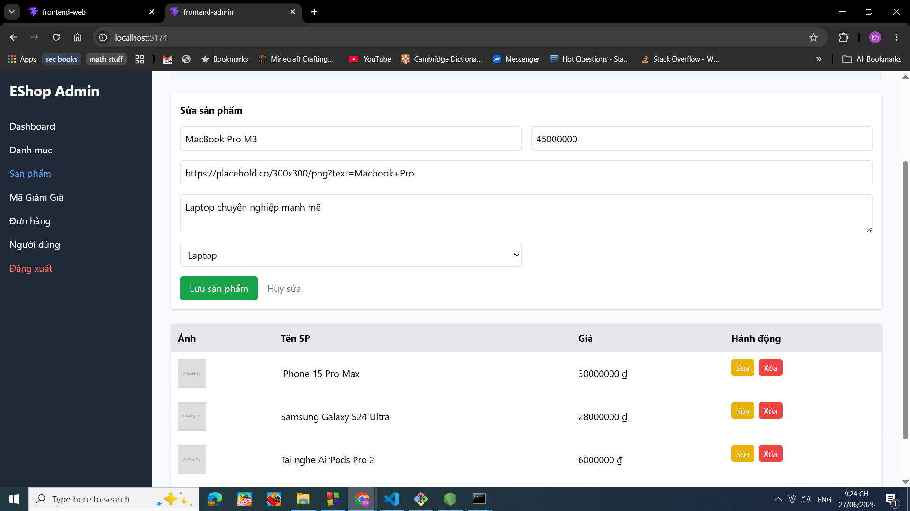
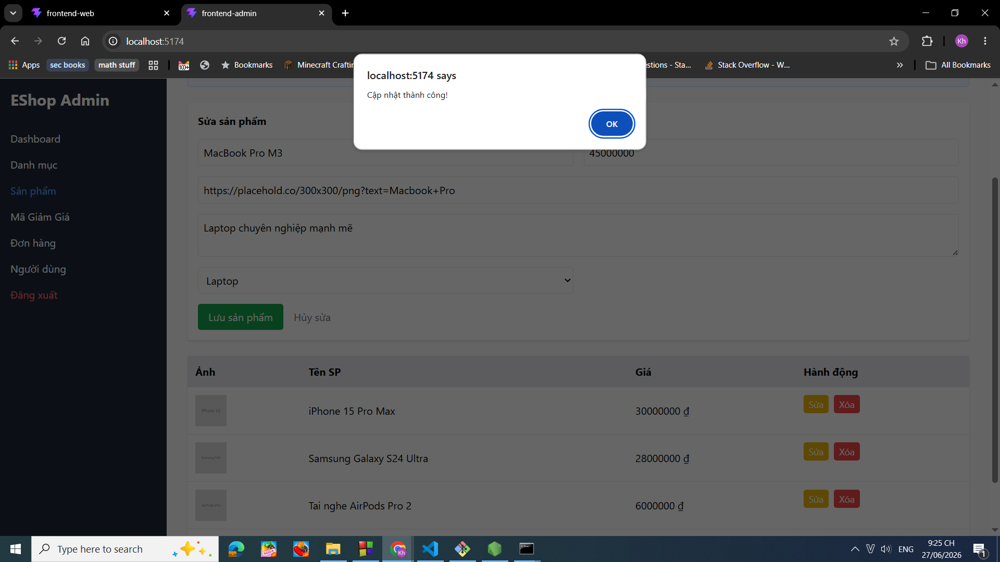
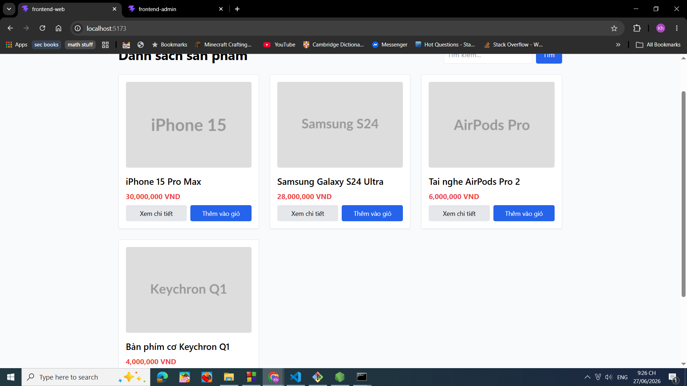

# BUG-FR15-PRODUCTDELETE-028: Hệ thống cho phép xoá sản phẩm khi đang chỉnh sửa sản phẩm

## Found by Test Case

TC-FR15-ProductDelete-028

## Requirement liên quan

FR-15 Product management (CRUD)

## Severity / Priority

Major / P1

## Environment

Windows 10, Google Chrome Version 149.0.7827.103

## Steps to reproduce

1. Chạy chương trình backend, frontend web, frontend admin
2. Truy cập vào trang web admin với đường dẫn [http://localhost:5174/](http://localhost:5174/)
3. Đăng nhập với tên email: admin@eshop.com và mật khẩu là Admin123!
4. Nhấn vào mục: Sản phẩm
5. Nhấn vào nút Sửa cho sản phẩm MacBook Pro M3
6. Nhấn vào nút Xoá cho sản phẩm MacBook Pro M3
7. Xác nhận xoá sản phẩm
8. Nhấn vào nút Lưu sản phẩm
9. Truy cập vào trang web người dùng với đường dẫn [http://localhost:5173/](http://localhost:5173/)

## Expected result

Sau khi thực hiện bước 5:

- Hệ thống hiện thông báo xác nhận xoá sản phẩm

Sau khi thực hiện bước 6:

- Hệ thống thông báo không xoá sản phẩm vì sản phẩm đang được chỉnh sửa
- Giao diện của admin còn thể hiện ra sản phẩm

Sau khi thực hiện bước 7:

- Giao diện vẫn còn sản phẩm tên MacBook Pro M3

## Actual result

Hệ thống ghi nhận xoá trong khi đang chỉnh sửa sản phẩm. Khi nhấn lưu thì sản phẩm vẫn hiện thông báo cập nhật thành công nhưng sản phẩm trong giao diện người dùng đã mất.

## Evidence

Ảnh trước khi xoá sản phẩm:

Ảnh sau khi nhấn vào nút xoá sản phẩm:

Ảnh sau khi nhấn vào nút lưu sản phẩm:

Ảnh giao diện người dùng:

