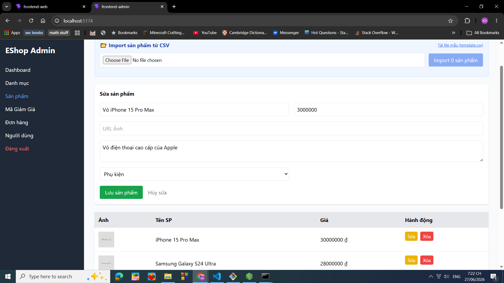
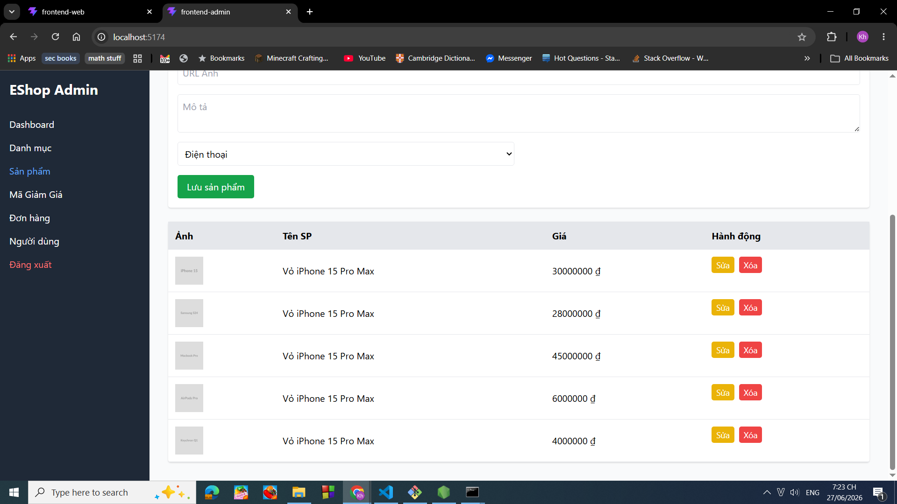
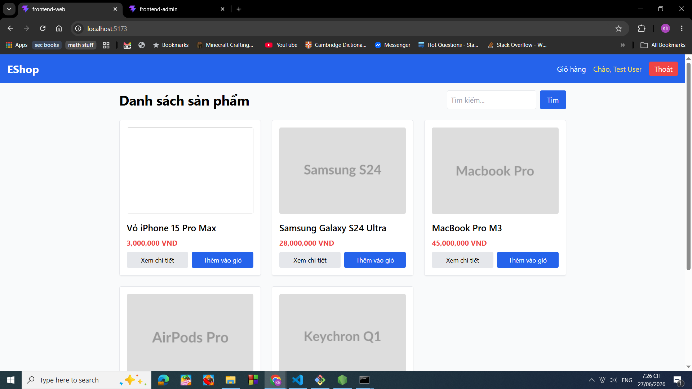

# BUG-FR15-PRODUCTEDIT-019: Hệ thống không chặn cập nhật sản phẩm khi ảnh đại diện rỗng

## Found by Test Case

TC-FR15-ProductEdit-019

## Requirement liên quan

FR-15 Product management (CRUD)

## Severity / Priority

Minor / P2

## Environment

Windows 10, Google Chrome Version 149.0.7827.103

## Steps to reproduce

1. Chạy chương trình backend, frontend web, frontend admin
2. Truy cập vào trang web admin với đường dẫn [http://localhost:5174/](http://localhost:5174/)
3. Đăng nhập với tên email: admin@eshop.com và mật khẩu là Admin123!
4. Nhấn vào mục: Sản phẩm
5. Nhấn vào nút Sửa của sản phẩm iPhone 15 Pro Max
6. Điền vào mục Tên sản phẩm giá trị Vỏ iPhone 15 Pro Max
7. Điền vào mục Giá tiền 3000000
8. Điền vào mục Mô tả: Vỏ điện thoại cao cấp của Apple
9. Chọn vào mục ghi "Điện thoại" và chỉnh lại thành giá trị "Phụ kiện"
10. Nhấn vào nút lưu sản phẩm.
11. Truy cập vào trang web người dùng với đường dẫn [http://localhost:5173/](http://localhost:5173/)
12. Nhấn vào Xem chi tiết của sản phẩm `iPhone 15 Pro Max`

## Expected result

Sau khi thực hiện bước 10:

- Hệ thống không ghi nhận thay đổi của sản phẩm
- Giao diện của admin vẫn giữ thông tin của sản phẩm đã chọn

Sau khi thực hiện bước 11:

- Giao diện còn hiện sản phẩm **iPhone 15 Pro Max**

Sau khi thực hiện bước 12:

- Giao diện người dùng thể hiện đầy đủ thông tin tên sản phẩm, mô tả, giá sản phẩm, hình ảnh đại diện của sản phẩm cũ.

## Actual result

Hệ thống vẫn ghi nhận chỉnh sửa và cập nhật lại anh đại diện của sản phẩm thành rỗng.

Giao diện của người dùng đểu hiện thông tin sản phẩm không có ảnh đại diện.

## Evidence

Ảnh trước khi chỉnh sửa sản phẩm:

Ảnh sau khi chỉnh sửa sản phẩm:

Ảnh giao diện người dùng:

