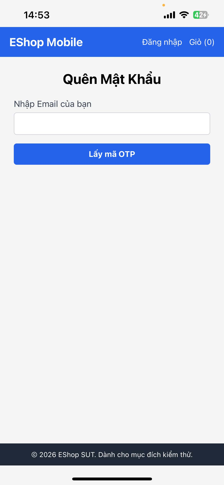

# BUG-FR23-002: Mobile thiếu nút Quay lại đăng nhập ở bước lấy OTP

## Found by Test Case
TC-FR23-DT-002

## Requirement liên quan
FR-23: Quên mật khẩu & Đặt lại mật khẩu trên Mobile

## Severity / Priority
Major / P2

## Environment
**Mobile**: React Native/Expo  
**OS**: Ubuntu 22.04  
**API URL**: http://172.20.10.3:3000/api  
**Build / Commit**: `8afc676`

## Steps to reproduce
1. Mở ứng dụng mobile.
2. Từ màn hình Đăng nhập, chọn Quên mật khẩu.
3. Quan sát màn hình lấy OTP.

## Expected result
Theo FR-23, màn hình lấy OTP trên mobile phải có nút Quay lại đăng nhập để người dùng có thể quay về màn hình Đăng nhập.

## Actual result
Màn hình lấy OTP trên mobile không hiển thị nút Quay lại đăng nhập.

## Evidence

## Status
Open
