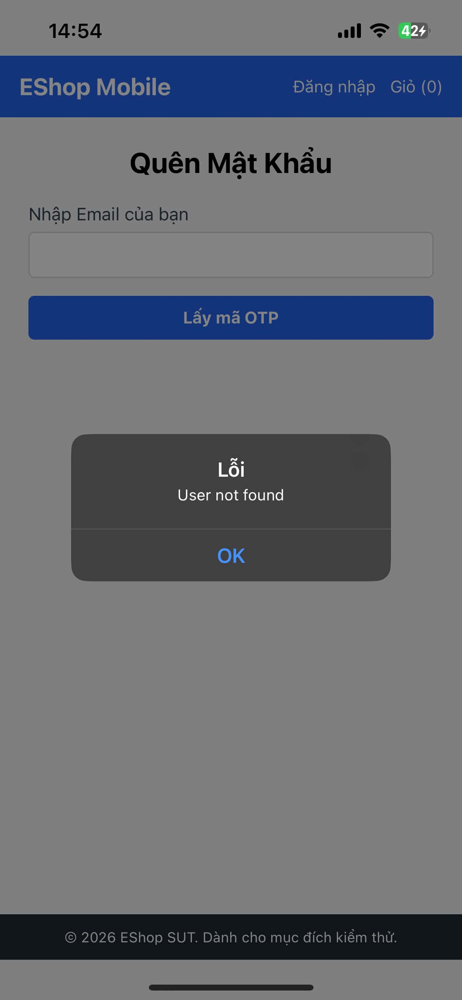
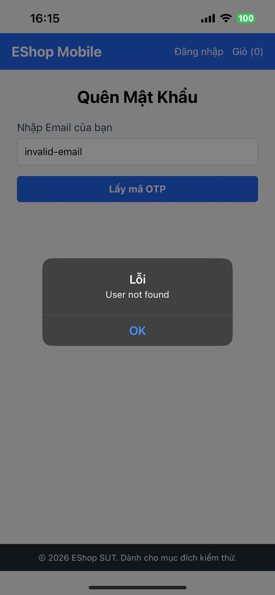

# BUG-FR23-003: Mobile báo User not found cho email rỗng hoặc sai định dạng

## Found by Test Case
TC-FR23-DT-003, TC-FR23-DT-004

## Requirement liên quan
FR-23: Quên mật khẩu & Đặt lại mật khẩu trên Mobile

## Severity / Priority
Major / P2

## Environment
**Mobile**: React Native/Expo  
**OS**: Ubuntu 22.04  
**API URL**: http://172.20.10.3:3000/api  
**Build / Commit**: `8afc676`

## Steps to reproduce
1. Mở ứng dụng mobile.
2. Vào màn hình Quên mật khẩu.
3. Để trống Email rồi bấm nút lấy OTP.
4. Lặp lại với Email sai định dạng, ví dụ `invalid-email`.
5. Kiểm tra lại qua API `POST /api/forgot-password` với email rỗng và email sai định dạng.

## Expected result
Ứng dụng mobile phải hiển thị lỗi rõ ràng theo từng miền lỗi: email rỗng thì báo bắt buộc nhập email; email sai định dạng thì báo lỗi định dạng email. Hệ thống không nên báo nhầm thành user không tồn tại.

## Actual result
Ứng dụng mobile hiển thị lỗi `User not found` cho cả email rỗng và email sai định dạng. API verification cũng trả `404 User not found` cho hai input này.

## Evidence
- Tester observation: email rỗng bị báo `User not found`.

- Tester observation: email sai định dạng bị báo `User not found`.

- API verification: `POST /api/forgot-password` với email rỗng hoặc `invalid-email` đều trả `404 User not found`.

## Status
Open
