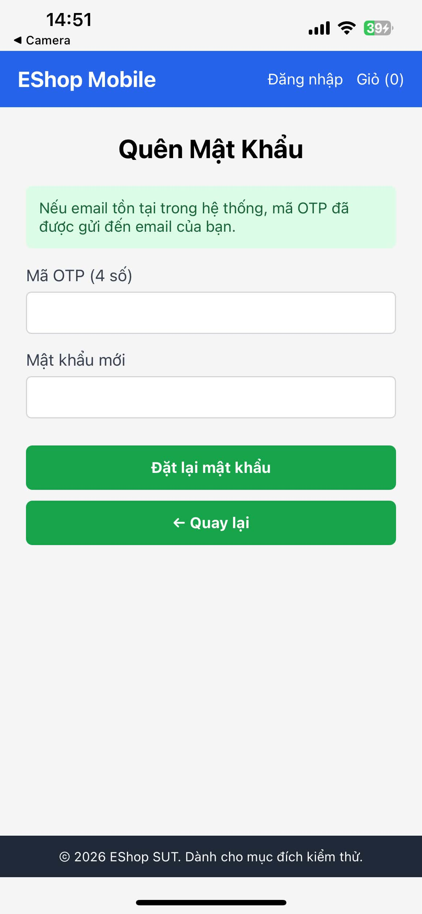

# BUG-FR23-004: Mobile thiếu ô Xác nhận mật khẩu mới ở bước đặt lại mật khẩu

## Found by Test Case
TC-FR23-DT-006, TC-FR23-DT-007, TC-FR23-DT-008, TC-FR23-DT-010, TC-FR23-DT-011, TC-FR23-DT-012, TC-FR23-BVA-005, TC-FR23-BVA-006

## Requirement liên quan
FR-23: Quên mật khẩu & Đặt lại mật khẩu trên Mobile

## Severity / Priority
Major / P1

## Environment
**Mobile**: React Native/Expo  
**OS**: Ubuntu 22.04  
**API URL**: http://172.20.10.3:3000/api  
**Build / Commit**: `8afc676`

## Steps to reproduce
1. Mở ứng dụng mobile.
2. Vào luồng Quên mật khẩu.
3. Chuyển tới bước đặt lại mật khẩu hoặc quan sát form reset password.
4. Kiểm tra các trường nhập liệu hiển thị trên form.

## Expected result
Theo FR-23, bước đặt lại mật khẩu trên mobile phải có đủ 3 trường: OTP, Mật khẩu mới và Xác nhận mật khẩu mới. Hệ thống phải từ chối nếu hai trường mật khẩu không khớp.

## Actual result
Form đặt lại mật khẩu trên mobile không có ô Xác nhận mật khẩu mới. Vì vậy không thể kiểm tra rule confirm password mismatch trong TC-FR23-DT-011 và các test reset password không xác nhận được hai trường mật khẩu khớp nhau.

## Evidence
Tester observation trong nhiều test case FR-23: form reset password chỉ có ô OTP, ô mật khẩu và nút đặt lại mật khẩu, không có ô xác nhận mật khẩu mới.

## Status
Open
