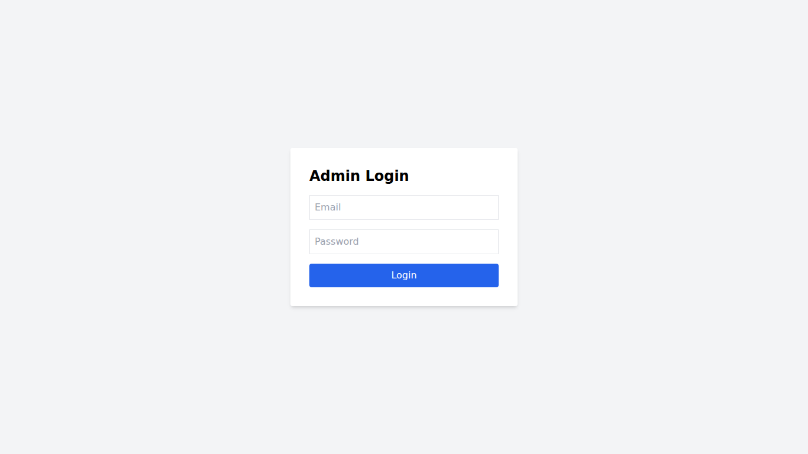

## Found by Test Case
GUI-001

## Requirement liên quan
SRS GUI-01 + FR-12

## Severity / Priority
Minor / P2

## Environment
Chromium headless, Web Admin URL `http://localhost:5174/`, Backend URL `http://localhost:3000`, thực thi theo checklist GUI.

## Steps to reproduce
1. Mở trang Admin Login tại `http://localhost:5174/`.
2. Quan sát tiêu đề, các trường nhập và nút submit trên form đăng nhập.
3. So sánh ngôn ngữ hiển thị với yêu cầu giao diện tiếng Việt nhất quán.

## Expected result
Màn hình Admin Login hiển thị tiếng Việt nhất quán, không lẫn nhãn tiếng Anh ngoài thuật ngữ kỹ thuật chuẩn.

## Actual result
Trang đăng nhập hiển thị các nhãn tiếng Anh như `Admin Login`, `Login`, `Email`, `Password`, nên chưa nhất quán với yêu cầu giao diện tiếng Việt.

## Evidence
- Screenshot: 
- Checklist row: `GUI-001`
