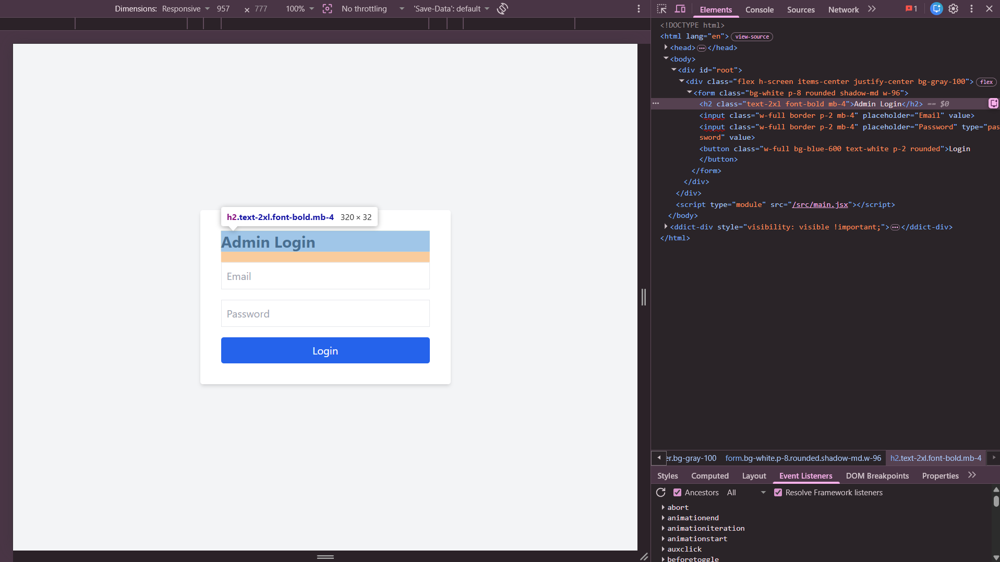

## Found by Test Case
GUI-002

## Requirement liên quan
SRS GUI-01

## Severity / Priority
Minor / P3

## Environment
Chrome, Web Admin URL `http://localhost:5174/`, Backend URL `http://localhost:3000`, thực thi theo checklist GUI.

## Steps to reproduce
1. Mở trang Admin Login tại `http://localhost:5174/`.
2. Kiểm tra heading structure bằng rendered DOM hoặc accessibility tree.
3. Đếm số lượng thẻ `<h1>` trên trang đăng nhập.

## Expected result
Màn hình Admin Login có đúng một tiêu đề chính `<h1>` mô tả rõ đây là trang đăng nhập quản trị.

## Actual result
Trang đăng nhập không có thẻ `<h1>`. Tiêu đề `Admin Login` đang là `h2`, nên trang thiếu tiêu đề chính.

## Evidence
- Screenshot: 
- Checklist row: `GUI-002`
