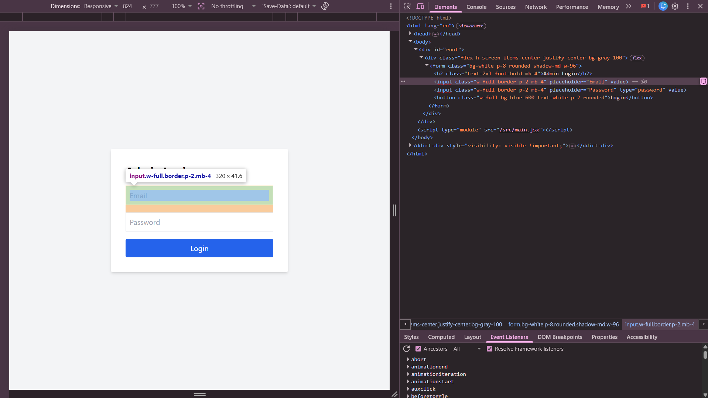

## Found by Test Case
GUI-003

## Requirement liên quan
SRS FR-02 + GUI-02

## Severity / Priority
Major / P1

## Environment
Chromium headless, Web Admin URL `http://localhost:5174/`, Backend URL `http://localhost:3000`, thực thi theo checklist GUI.

## Steps to reproduce
1. Mở trang Admin Login tại `http://localhost:5174/`.
2. Kiểm tra trường Email trên form đăng nhập.
3. Nhập email sai định dạng và submit form.
4. Quan sát việc validate định dạng email trước hoặc khi submit.

## Expected result
Trường Email trên form đăng nhập admin dùng validate định dạng email và từ chối email sai định dạng trước hoặc khi submit.

## Actual result
Input Email có type rỗng/không phải `email`, nên browser không hỗ trợ validate định dạng email đúng cách cho form đăng nhập admin.

## Evidence
- Screenshot: 
- Checklist row: `GUI-003`
