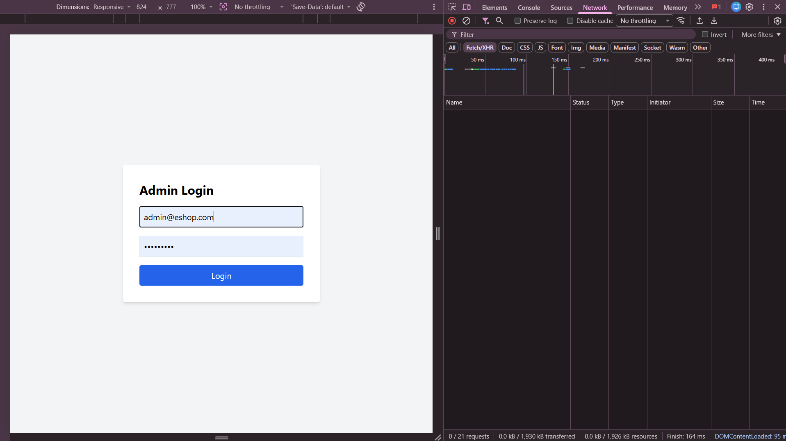

## Found by Test Case
GUI-009

## Requirement liên quan
GUI_Testing state-based + SRS GUI-04

## Severity / Priority
Minor / P2

## Environment
Chrome, Web Admin URL `http://localhost:5174/`, Backend URL `http://localhost:3000`, thực thi theo checklist GUI.

## Steps to reproduce
1. Mở trang Admin Login tại `http://localhost:5174/`.
2. Nhập thông tin đăng nhập admin.
3. Bấm nút Login.
4. Quan sát trạng thái của nút trong lúc request đang xử lý.

## Expected result
Khi bấm đăng nhập, giao diện có trạng thái loading/disabled rõ ràng để tránh submit lặp.

## Actual result
Nút Login không chuyển sang trạng thái loading hoặc disabled rõ ràng trong quá trình submit, nên không thể hiện cơ chế chống bấm lặp.

## Evidence
- Screenshot: 
- Checklist row: `GUI-009`
