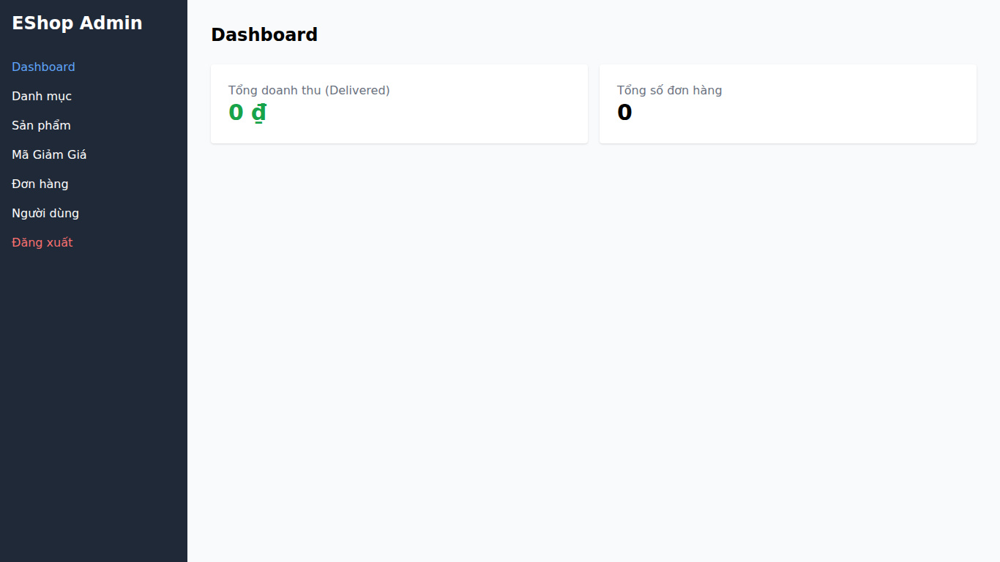

## Found by Test Case
GUI-012

## Requirement liên quan
SRS GUI-01

## Severity / Priority
Minor / P3

## Environment
Chromium headless, Web Admin URL `http://localhost:5174/`, Backend URL `http://localhost:3000`, thực thi theo checklist GUI.

## Steps to reproduce
1. Đăng nhập Web Admin bằng tài khoản admin hợp lệ.
2. Mở Admin Dashboard.
3. Kiểm tra heading structure bằng rendered DOM hoặc accessibility tree.
4. Xác định heading nào đang là `<h1>`.

## Expected result
Dashboard có đúng một `<h1>` mô tả nội dung trang quản trị tổng quan.

## Actual result
Thẻ `<h1>` duy nhất là `EShop Admin`. Tiêu đề nội dung Dashboard đang là `h2`, nên nội dung trang không có tiêu đề chính riêng.

## Evidence
- Screenshot: 
- Checklist row: `GUI-012`
