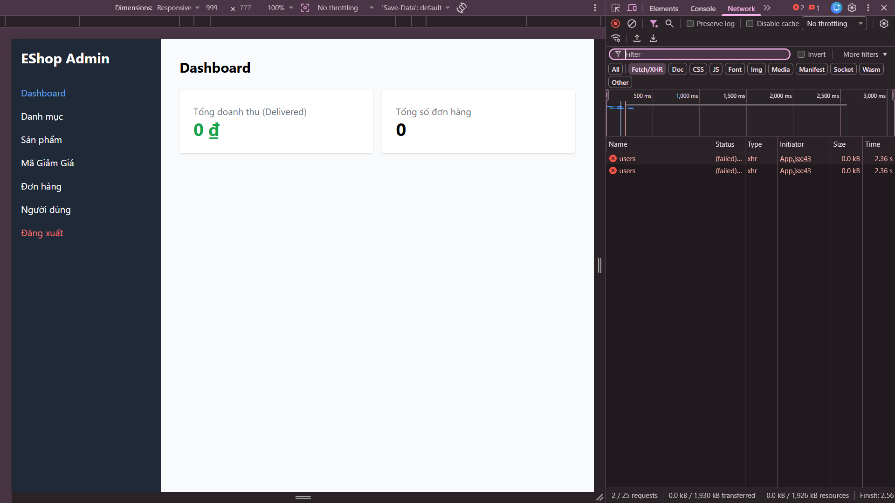

## Found by Test Case
GUI-019

## Requirement liên quan
GUI_Testing state-based + Usability heuristic

## Severity / Priority
Major / P1

## Environment
Chrome, Web Admin URL `http://localhost:5174/`, backend không khả dụng trong bước kiểm tra error state.

## Steps to reproduce
1. Đăng nhập Web Admin bằng tài khoản admin hợp lệ.
2. Làm backend không khả dụng hoặc ngắt quá trình tải API Dashboard.
3. Mở hoặc refresh Admin Dashboard.
4. Quan sát UI khi dữ liệu Dashboard không tải được.

## Expected result
Khi không tải được dữ liệu Dashboard, giao diện hiển thị error state dễ hiểu và có hướng xử lý hoặc nút thử lại.

## Actual result
Khi backend không khả dụng, Dashboard không hiển thị thông báo lỗi rõ ràng hoặc hành động khôi phục. Giao diện hiển thị các giá trị mặc định, khiến lỗi tải dữ liệu khó nhận biết.

## Evidence
- Screenshot: 
- Checklist row: `GUI-019`
