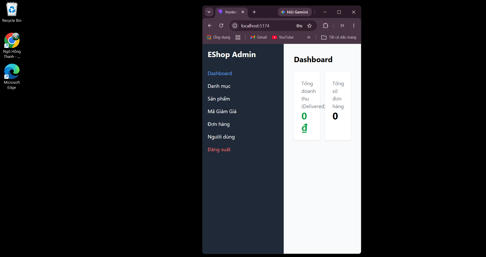

## Found by Test Case
GUI-020

## Requirement liên quan
GUI_Testing responsive + SRS GUI-01

## Severity / Priority
Major / P2

## Environment
Chrome/Chromium với viewport hẹp, Web Admin URL `http://localhost:5174/`, Backend URL `http://localhost:3000`, thực thi theo checklist GUI. Chưa test trực tiếp trên mobile app/page.

## Steps to reproduce
1. Đăng nhập Web Admin bằng tài khoản admin hợp lệ.
2. Mở Admin Dashboard.
3. Resize browser sang viewport hẹp tương tự tablet/mobile.
4. Quan sát các card thống kê, sidebar/menu và vùng nội dung chính.

## Expected result
Ở viewport tablet/mobile, các card thống kê và menu quản trị không tràn ngang, không che mất nội dung chính.

## Actual result
Ở viewport hẹp, layout bị co lại quá mức thay vì có responsive layout rõ ràng hoặc cơ chế scroll ngang có kiểm soát.

## Evidence
- Screenshot: 
- Checklist row: `GUI-020`
