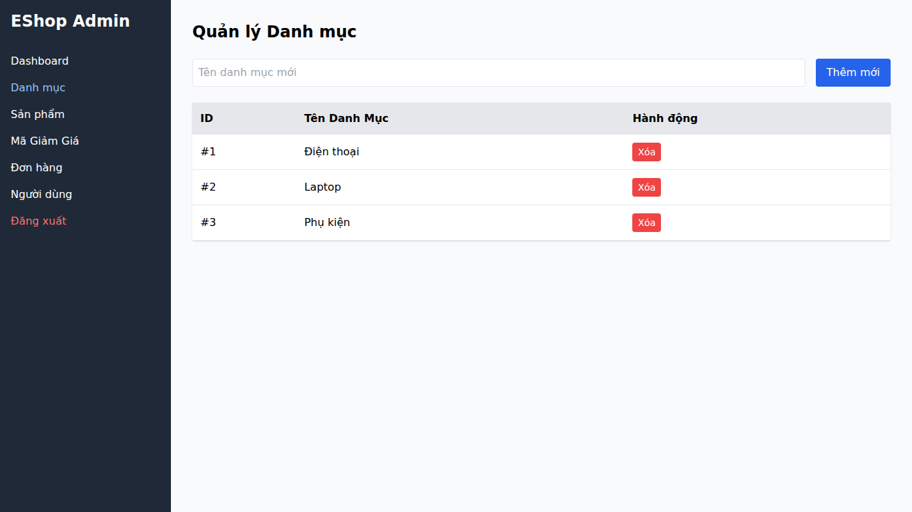

## Found by Test Case
GUI-024

## Requirement liên quan
SRS GUI-02 + FR-14

## Severity / Priority
Minor / P3

## Environment
Chrome, Web Admin URL `http://localhost:5174/`, Backend URL `http://localhost:3000`, thực thi theo checklist GUI.

## Steps to reproduce
1. Đăng nhập Web Admin bằng tài khoản admin hợp lệ.
2. Đi tới Category Management / Danh mục.
3. Quan sát form thêm danh mục.
4. Kiểm tra trường Tên danh mục có nhãn và ký hiệu `*` hay không.

## Expected result
Form thêm danh mục đánh dấu trường Tên danh mục là bắt buộc bằng ký hiệu `*`.

## Actual result
Form thêm danh mục chỉ hiển thị placeholder `Tên danh mục mới`, không có nhãn trường bắt buộc kèm ký hiệu `*`.

## Evidence
- Screenshot: 
- Checklist row: `GUI-024`
