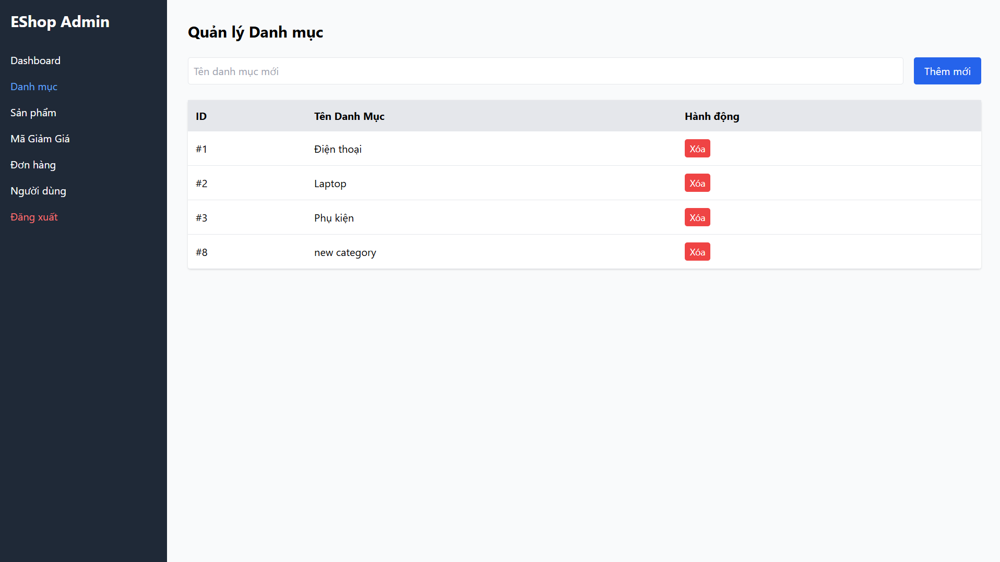

## Found by Test Case
GUI-026

## Requirement liên quan
SRS FR-14 + GUI_Testing feedback

## Severity / Priority
Minor / P2

## Environment
Chrome, Web Admin URL `http://localhost:5174/`, Backend URL `http://localhost:3000`, thực thi theo checklist GUI.

## Steps to reproduce
1. Đăng nhập Web Admin bằng tài khoản admin hợp lệ.
2. Đi tới Category Management / Danh mục.
3. Nhập tên danh mục hợp lệ.
4. Submit form thêm danh mục.
5. Quan sát phản hồi sau khi danh mục được thêm.

## Expected result
Sau khi thêm danh mục hợp lệ, giao diện có phản hồi thành công rõ ràng và danh mục mới xuất hiện trong danh sách.

## Actual result
Danh mục mới xuất hiện trong danh sách, nhưng giao diện không hiển thị thông báo thành công rõ ràng sau thao tác thêm.

## Evidence
- Screenshot: 
- Checklist row: `GUI-026`
