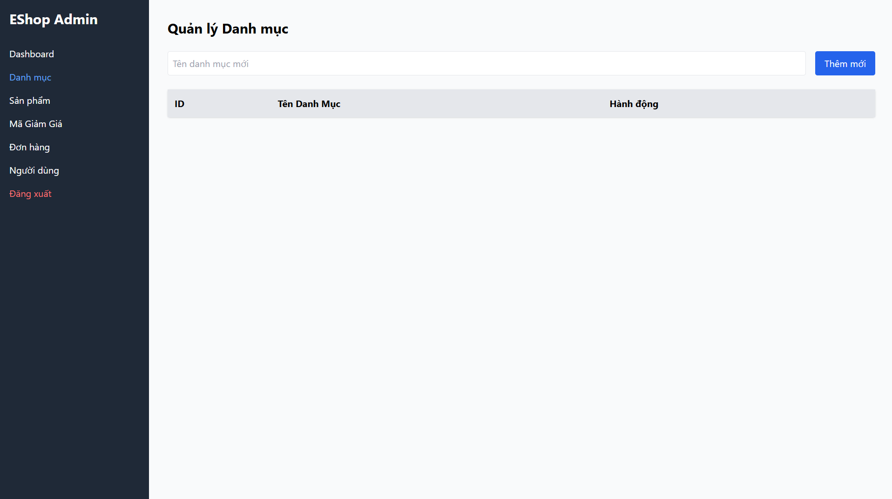

## Found by Test Case
GUI-027

## Requirement liên quan
SRS GUI-04 + GUI_Testing state-based

## Severity / Priority
Minor / P3

## Environment
Chrome, Web Admin URL `http://localhost:5174/`, Backend URL `http://localhost:3000`, thực thi theo checklist GUI.

## Steps to reproduce
1. Đăng nhập Web Admin bằng tài khoản admin hợp lệ.
2. Đi tới Category Management / Danh mục.
3. Chuẩn bị hoặc quan sát trạng thái danh sách danh mục rỗng.
4. Quan sát vùng danh sách danh mục.

## Expected result
Khi danh sách danh mục rỗng, giao diện hiển thị empty state thân thiện thay vì bảng trắng hoặc lỗi kỹ thuật.

## Actual result
Giao diện hiển thị bảng/vùng trắng thay vì empty state thân thiện giải thích rằng chưa có danh mục.

## Evidence
- Screenshot: 
- Checklist row: `GUI-027`
