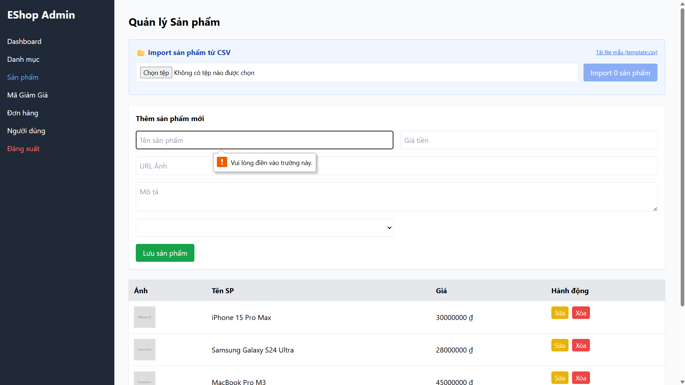

## Found by Test Case
GUI-035

## Requirement liên quan
SRS FR-15 + GUI-02

## Severity / Priority
Minor / P2

## Environment
Chrome, Web Admin URL `http://localhost:5174/`, Backend URL `http://localhost:3000`, thực thi theo checklist GUI.

## Steps to reproduce
1. Đăng nhập Web Admin bằng tài khoản admin hợp lệ.
2. Đi tới Product Management / Sản phẩm.
3. Để trống trường Tên sản phẩm.
4. Bấm lưu sản phẩm.
5. Quan sát vị trí và nội dung lỗi validation.

## Expected result
Khi bỏ trống Tên sản phẩm, lỗi validation hiển thị rõ và không cho lưu sản phẩm.

## Actual result
Form dựa vào native validation của browser cho trường Tên sản phẩm rỗng. Không có thông báo lỗi cấp ứng dụng hiển thị rõ gần form hoặc phía trên nút submit.

## Evidence
- Screenshot: 
- Checklist row: `GUI-035`
