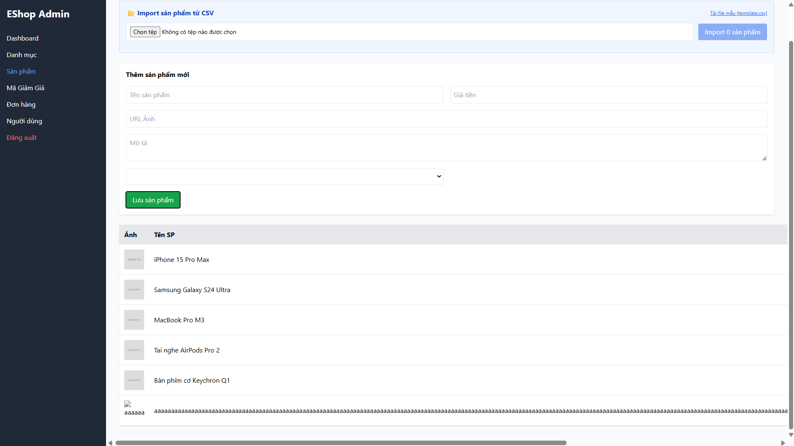

## Found by Test Case
GUI-036

## Requirement liên quan
SRS FR-15 + GUI_Testing validation

## Severity / Priority
Major / P1

## Environment
Chrome, Web Admin URL `http://localhost:5174/`, Backend URL `http://localhost:3000`, thực thi theo checklist GUI.

## Steps to reproduce
1. Đăng nhập Web Admin bằng tài khoản admin hợp lệ.
2. Đi tới Product Management / Sản phẩm.
3. Nhập Tên sản phẩm dài hơn 255 ký tự.
4. Nhập hợp lệ các trường còn lại.
5. Bấm lưu sản phẩm.
6. Quan sát UI có chặn dữ liệu sai độ dài và hiển thị lỗi hay không.

## Expected result
Khi nhập Tên sản phẩm dài hơn 255 ký tự, giao diện hiển thị lỗi rõ ràng và không cho lưu.

## Actual result
Tên sản phẩm dài 256 ký tự vẫn được gửi request. UI không chặn độ dài không hợp lệ và không hiển thị lỗi rõ ràng trước khi submit.

## Evidence
- Screenshot: 
- Checklist row: `GUI-036`
