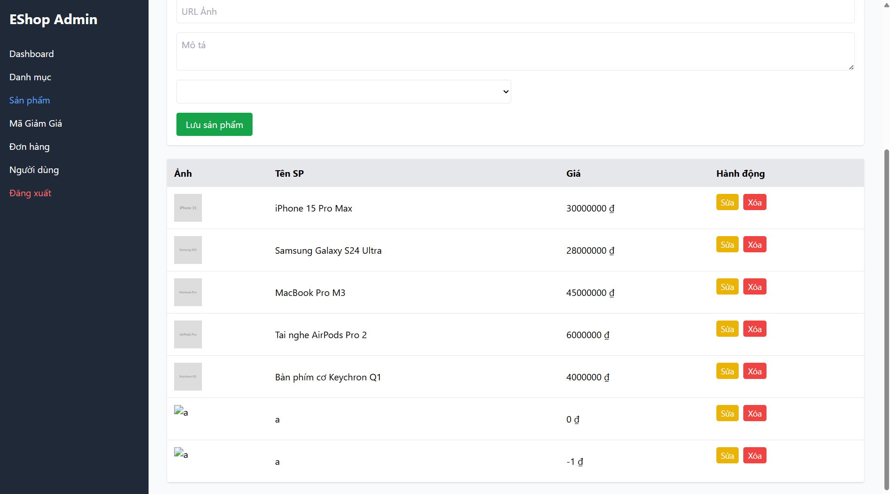

## Found by Test Case
GUI-037

## Requirement liên quan
SRS FR-15 + GUI_Testing validation

## Severity / Priority
Major / P1

## Environment
Chrome, Web Admin URL `http://localhost:5174/`, Backend URL `http://localhost:3000`, thực thi theo checklist GUI.

## Steps to reproduce
1. Đăng nhập Web Admin bằng tài khoản admin hợp lệ.
2. Đi tới Product Management / Sản phẩm.
3. Nhập Giá bằng `0`, số âm hoặc giá trị không phải số.
4. Nhập hợp lệ các trường còn lại.
5. Bấm lưu sản phẩm.
6. Quan sát UI có chặn dữ liệu giá không hợp lệ và hiển thị lỗi hay không.

## Expected result
Khi nhập Giá bằng 0, số âm hoặc không phải số, form hiển thị lỗi rõ ràng và không cho lưu sản phẩm.

## Actual result
Giá `<=0` vẫn được gửi request. UI không hiển thị lỗi validation rõ ràng trước khi submit.

## Evidence
- Screenshot: 
- Checklist row: `GUI-037`
