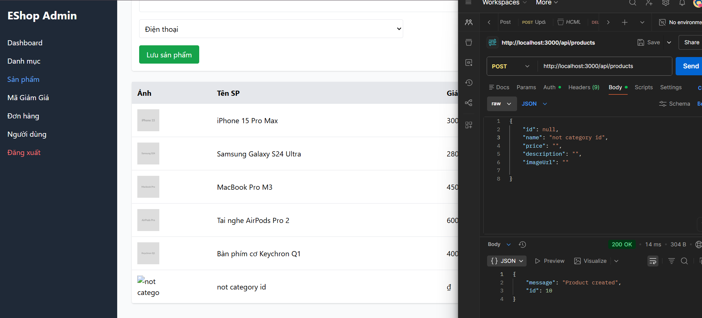

## Found by Test Case
GUI-038

## Requirement liên quan
SRS FR-15 + GUI-02

## Severity / Priority
Major / P2

## Environment
Chrome, Web Admin URL `http://localhost:5174/`, Backend URL `http://localhost:3000`, thực thi theo checklist GUI.

## Steps to reproduce
1. Đăng nhập Web Admin bằng tài khoản admin hợp lệ.
2. Đi tới Product Management / Sản phẩm.
3. Mở form thêm/sửa sản phẩm.
4. Quan sát trường Danh mục khi form mới được hiển thị.
5. Thử lưu sản phẩm mà không chủ động chọn danh mục.

## Expected result
Trường Danh mục buộc chọn từ danh sách có sẵn và báo lỗi nếu admin chưa chọn danh mục.

## Actual result
Dropdown Danh mục mặc định chọn sẵn danh mục đầu tiên, không có placeholder yêu cầu chọn chủ động. UI cũng không báo lỗi rõ ràng khi gọi API mà không truyền `category_id`.

## Evidence
- Screenshot: 
- Checklist row: `GUI-038`
