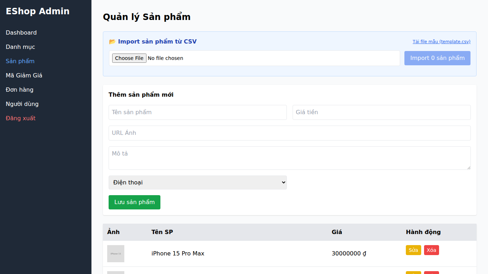

## Found by Test Case
GUI-039

## Requirement liên quan
SRS FR-15 + GUI_Testing feedback

## Severity / Priority
Minor / P2

## Environment
Chrome, Web Admin URL `http://localhost:5174/`, Backend URL `http://localhost:3000`, thực thi theo checklist GUI.

## Steps to reproduce
1. Đăng nhập Web Admin bằng tài khoản admin hợp lệ.
2. Đi tới Product Management / Sản phẩm.
3. Nhập thông tin sản phẩm hợp lệ.
4. Bấm lưu/thêm sản phẩm.
5. Quan sát phản hồi sau khi sản phẩm được thêm vào danh sách.

## Expected result
Sau khi thêm sản phẩm hợp lệ, giao diện hiển thị feedback thành công và sản phẩm xuất hiện trong danh sách.

## Actual result
Sản phẩm mới xuất hiện trong danh sách, nhưng giao diện không hiển thị feedback thành công rõ ràng sau thao tác thêm.

## Evidence
- Screenshot: 
- Checklist row: `GUI-039`
