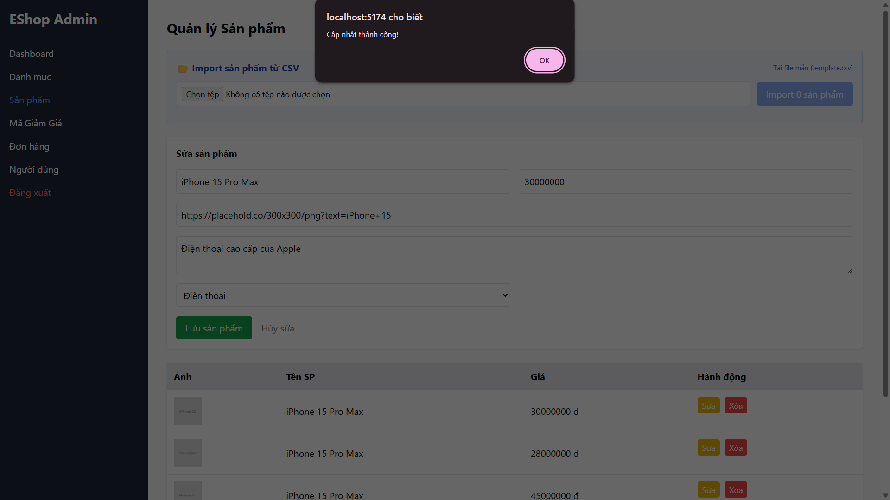

## Found by Test Case
GUI-040

## Requirement liên quan
SRS FR-15 + Usability heuristic

## Severity / Priority
Minor / P2

## Environment
Chromium headless, Web Admin URL `http://localhost:5174/`, Backend URL `http://localhost:3000`, thực thi theo checklist GUI.

## Steps to reproduce
1. Đăng nhập Web Admin bằng tài khoản admin hợp lệ.
2. Đi tới Product Management / Sản phẩm.
3. Bấm Sửa trên một sản phẩm.
4. Thay đổi thông tin sản phẩm.
5. Bấm Lưu sản phẩm.
6. Quan sát thông báo sau khi cập nhật.

## Expected result
Khi sửa một sản phẩm, giao diện phản hồi rõ sản phẩm nào đã được cập nhật và không làm admin nhầm với các sản phẩm khác.

## Actual result
Form chuyển sang trạng thái `Sửa sản phẩm`, đổ dữ liệu lên form và có nút `Hủy sửa`. Tuy nhiên sau khi bấm Lưu sản phẩm, UI chỉ có thông báo thành công chung, không nói rõ sản phẩm nào đã được cập nhật.

## Evidence
- Screenshot: 
- Checklist row: `GUI-040`
