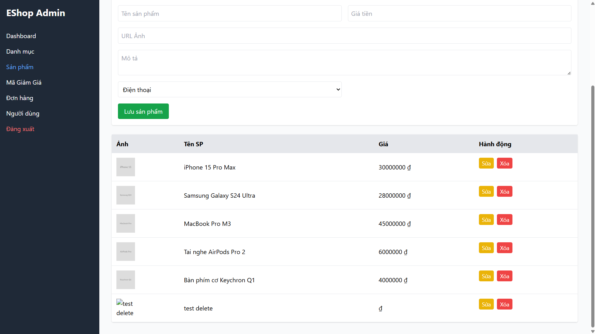
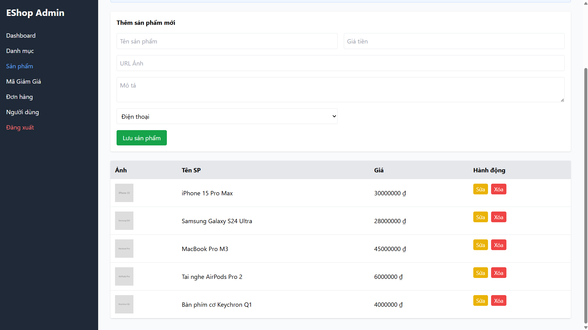

## Found by Test Case
GUI-041

## Requirement liên quan
GUI_Testing risk-based + Feedback

## Severity / Priority
Major / P1

## Environment
Chromium headless, Web Admin URL `http://localhost:5174/`, Backend URL `http://localhost:3000`, thực thi theo checklist GUI.

## Steps to reproduce
1. Đăng nhập Web Admin bằng tài khoản admin hợp lệ.
2. Đi tới Product Management / Sản phẩm.
3. Bấm thao tác xóa trên một sản phẩm.
4. Quan sát UI có yêu cầu xác nhận trước khi xóa hay không.

## Expected result
Khi xóa sản phẩm, giao diện yêu cầu xác nhận trước thao tác nguy hiểm và hiển thị kết quả sau khi xóa.

## Actual result
Thao tác xóa sản phẩm không hiển thị confirmation dialog trước khi thực hiện hành động nguy hiểm.

## Evidence
- Screenshot: 
- Screenshot: 
- Checklist row: `GUI-041`
