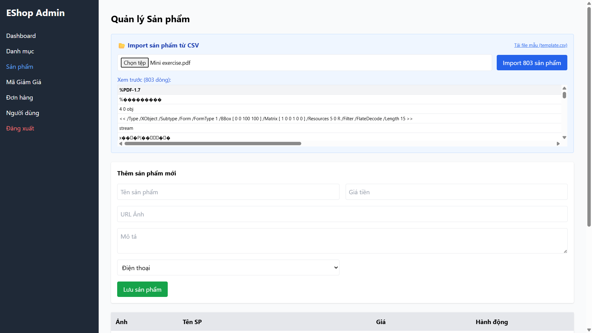

## Found by Test Case
GUI-044

## Requirement liên quan
SRS FR-16 + GUI_Testing validation

## Severity / Priority
Major / P1

## Environment
Chrome, Web Admin URL `http://localhost:5174/`, Backend URL `http://localhost:3000`, thực thi theo checklist GUI.

## Steps to reproduce
1. Đăng nhập Web Admin bằng tài khoản admin hợp lệ.
2. Đi tới Product Management / Sản phẩm.
3. Mở section CSV import.
4. Chọn một file không phải `.csv`.
5. Quan sát file picker/vùng upload và thông báo validation.

## Expected result
File picker hoặc vùng upload chỉ chấp nhận file `.csv` và hiển thị lỗi rõ khi chọn file sai định dạng.

## Actual result
UI cho phép upload các loại file khác, không giới hạn rõ file `.csv` và không hiển thị lỗi định dạng đủ rõ ngay tại bước chọn file.

## Evidence
- Screenshot: 
- Checklist row: `GUI-044`
